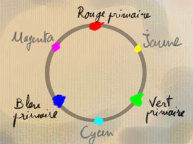

## La synthèse additive
### La synthèse additive, usage en arts plastiques
 **La synthèse additive**  

_Quand la lumière émane de la surface picturale, la synthèse des couleurs est additive._

_L'écran de votre ordinateur ou de votre télévision fonctionne sur ce principe. Avec une simple loupe, vous pouvez constater que chaque pixel est composé d'un ensemble de trois points lumineux colorés juxtaposés (un rouge, un vert et un bleu) dont la machine détermine le degré de luminosité de sorte à composer des variations de couleurs - lire [](http://www.pourpre.com/modrvb.php)[Le système RVB sur Pourpre.com](http://www.pourpre.com/modrvb.php). Généralement, chacun des trois points peut adopter 256 valeurs différentes, formant 224 combinaisons soit 16 millions de couleurs. Ne croyez pas que cela dépasse la sensibilité de l'oeil humain : celui-ci peut détecter des "crénages" dans les dégradés monochromes sur de vastes zones de l'écran._

La synthèse additive ne concerne pas seulement les vidéastes et les infographes. Comme il a été dit [en tête de cette section consacrée aux synthèses de couleurs](synthesedecouleurs.html), des "effets de bord" peuvent se produire lorsqu'un peintre travaille en transparence, particulièrement lorsque les valeurs sont très claires, la pâte extrêmement peu couvrante et le fond blanc très lumineux. Le mélange bleu + jaune tend alors vers le gris au lieu du vert.

D'autre part, les artistes jouant sur l'éclairage pour leurs installations, leurs performances en _sky art_, les éclairagistes, cinéastes, cadreurs, photographes, etc., ont massivement recours à cette synthèse. _Il s'agit en fait d'un domaine professionnel où il est question de [corps noir](corpsnoir.html), de laser, de raies d'émission ou d'absorption et de [températures de couleurs](corpsnoir.html#temperaturedecouleurs) entre autres concepts exigeant une formation solide. Dotapea.com n'est pas en mesure à ce jour de proposer un exposé approfondi. La page consacrée au corps noir et aux températures de couleurs est une ébauche._

En attendant, voici une présentation succincte de la synthèse additive.



Les autres couleurs importantes du spectre chromatique ne sont pas à proprement parler des secondaires issues d'un mélange binaire. Elles font varier les intensités et le nombre de composants.

> \*  violet \= un seul composant : le magenta, mais foncé, peu lumineux (magenta / 2)
> 
> \*  orangé \= deux composants : rouge + 1/2 vert
> 
> \*  vert-jaune \= trois composants : un jaune composé avec un peu moins de rouge et une forte proportion de bleu.

Comme pour la synthèse additive, deux couleurs complémentaires sont éloignées sur le cercle d'un arc de 180°. Elles forment en mélange un gris et deux couleurs presque complémentaires donnent des teintes complexes, subtiles ou sales.


 [Communication](http://www.artrealite.com/annonceurs.htm) 

[](index-2.html#20131014)


```
title: La synthèse additive
date: Fri Dec 22 2023 11:28:33 GMT+0100 (Central European Standard Time)
author: postite
```
