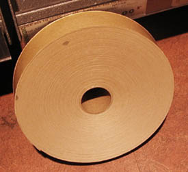

## La tension du papier
### La tension du papier, usage en arts plastiques
 **La tension du papier**  

Cette op�ration est destin�e � �viter les d�formations d'un papier _m�me �pais_ employ� comme support d'une peinture aqueuse comme l'aquarelle ou le lavis en particulier (proc�d�s tr�s fluides).

> 1. Imbiber le papier d'eau _recto verso_ (il n'est pas exclu de le plonger int�gralement dans l'eau). Un produit colorant peut �tre ajout� d�s ce moment pour donner une teinte � la feuille. A ce stade, �viter les peintures [r�versible](qr.html#reversibilite).
> 
> 2\. Le plaquer sur une planche �paisse, parfaitement plane (planche � dessin ou autre).
> 
> 3\. "Scotcher" le papier avec du [kraft gomm�](papiersspeciaux.html#kraftgomme) (qui devient tr�s collant au contact de l'eau). Voir photo ci-dessous.
> 
> 4. Attendre que la feuille soit s�che. En perdant son eau, elle va se tendre consid�rablement. . Une fois s�che, elle est pr�te � l'emploi.



Il peut arriver que le kraft l�che. Il suffit en principe de r�it�rer l'op�ration.

Un papier fort (papier aquarelle de 300 g/m2, papier lavis de 224 g/m2, kraft de 130 g/m2 au moins, n�palais �pais ou tout autre papier de plus de 220 g/m2, chiffre � augmenter �ventuellement si le [papier](papier.html) est peu coll�) est n�cessaire. Voir _[Les papiers pour l'aquarelle](papierspourlaquarelle.html)_, _[Les papiers pour la gouache.](papiersgouache.html)_

Le travail doit ensuite �tre d�coup� au cutter, le long de la bande de kraft gomm�.

Comme support pour la peinture � l'huile ou � l'acrylique, ce proc�d� de collage est rarement employ�. La feuille doit �tre tendue (sur ch�ssis ou autre support) et le rester. Il faut la traiter comme une toile (voir [tension d'une toile sur ch�ssis](tensionsurchassis.html)) et donc l'encoller.

Une autre op�ration est r�alisable�: le [marouflage](marouflage.html) pr�alable. Coll� sur une surface dure, impr�gn� d'enduit/colle, le papier devient un support tr�s s�r pour presque tous les proc�d�s de peinture. Son grain gagne � �tre mis � profit plut�t qu'� �tre att�nu� par un gesso au demeurant inutile. Lorsque la peinture est grasse, une couche de liant vinylique ou acrylique employ� comme enduit permettra de le garder � peu pr�s intact.


 [Communication](http://www.artrealite.com/annonceurs.htm) 

[](index-2.html#20131014)


```
title: La tension du papier
date: Fri Dec 22 2023 11:28:37 GMT+0100 (Central European Standard Time)
author: postite
```
