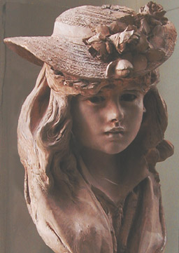
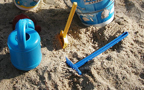

## Les terres, supports, substrats
### Les terres, supports, substrats, usage en arts plastiques
 **Les terres(supports, substrats)**  

_Lire pr�alablement de pr�f�rence [l'article du glossaire](argile.html)_

_Modelage et moulage de l'argile�: [lire l'article consacr� � ce sujet](argilemodmoul.html)_

_L'argile dans le ciment : [lire l'article consacr� au ciment](ciment.html)_

La terre comme support ou comme substrat de l'oeuvre artistique, c'est pratiquement toujours de l'argile. Nous connaissons celle-ci sous des noms vari�s�: kaolin, argile rouge, fa�ence, porcelaine, gr�s, etc. 

Elle est aussi courante qu'utile. L'humanit� lui doit des avanc�es extraordinaires. Notamment, l'av�nement du n�olithique co�ncide dans de nombreuses r�gions avec la r�alisation des premi�res poteries cuites (en France, d�s 5 000 BC [\*](terressupports.html#1), au Japon bien avant [\*\*](terressupports.html#2)). Stockage et transport deviennent infiniment plus ais�s, acquis essentiel � l'heure o� l'�tre humain commence � devenir ici agriculteur, l� citadin. Sans oublier que la marmite appara�t en m�me temps, signalant la naissance de la cuisine mijot�e, autre grandiose invention humaine.

L'art du pal�olithique exploitait d�j� sporadiquement les possibilit�s plastiques formidables, m�me � froid, de l'argile avant la naissance des arts du feu (extraordinaires bison de la grotte du Tuc d'Audoubert, Ari�ge, France). La cuisson se r�v�le cependant n�cessaire dans la plupart des cas, qu'il s'agisse d'emplois utilitaires ou artistiques.

**Pr�cisions pr�liminaires**

Dans cet article, conform�ment � notre choix �ditorial de segmenter le moins possible le savoir, les informations pr�sent�es concernent autant la sculpture que la poterie ainsi que toute technique d'application utilisant la terre comme support ou comme substrat.

De nos jours, des sculpteurs s'int�ressent � des techniques consid�r�es nagu�re comme relevant de la poterie ou de la mosa�que (les [�maux](email.html) notamment). 

Les techniques de modelage et de cuisson des terres sont innombrables et d'une grande complexit�.

De nombreuses terres peuvent �tre employ�es pures. D'autres n�cessitent un m�lange. Cela d�pend � la fois de la nature de la mati�re et du type de travail � effectuer. Dotapea n'est pas � proprement parler un site p�dagogique et _l'on n'y trouvera pas d'informations sur les proportions_ � respecter dans les m�langes en fonction des facteurs plasticit�, couleur, temp�rature de cuisson, adh�rence de [l'�mail](email.html) ([couverte](couverte.html) ou [gla�ure](glacure.html)).

**Sommaire**

[Pr�cisions pr�liminaires](terressupports.html#precisionspreliminaires)

[Granulation et autres facteurs d�terminant la plasticit�](terressupports.html#granulation)

[Composition, gen�se](terressupports.html#compositiongenese)

[Le retrait, les retraits](terressupports.html#leretraitlesretraits)

[Les phases de la cuisson](terressupports.html#lesphasesdelacuisson)

[La vitrification](terressupports.html#vitrification)

[Contraintes pr�alables � la cuisson](terressupports.html#contraintespreparatoiresalacuisson)

[�videment](terressupports.html#evidement)

[Adjonction initiale de terres et de produits](terressupports.html#adjonctiondeproduits)

[Entassement de pi�ces dans le four](terressupports.html#entassementdepiecesdanslefour)

[Aspects connexes](terressupports.html#aspectsconnexes)

[En vrac](terressupports.html#notesdiverses)

[Couleurs](terressupports.html#couleurs)

[L'argile, support � peindre](terressupports.html#largilesupportapeindre)

[Durcir sans cuisson](terressupports.html#durcirsanscuisson)

[L'adobe (I)](terressupports.html#adobe)

[Argiles � briques et arts plastiques](terressupports.html#argilesabriquesetartsplastiques)

[Types d'argiles](terressupports.html#typesdargiles)

[La fa�ence](terressupports.html#lafaience)

[Le kaolin](terressupports.html#lekaolin)

[Les terres glaises](terressupports.html#lesterresglaises)

[Les ball clays](terressupports.html#lesballclays)

[Le gr�s](terressupports.html#legreslesterresagres)

[Cas particuliers](terressupports.html#casparticuliers)

[Les terres � feu ou argiles r�fractaires](terressupports.html#lesterresafeu)

[Les terres � casettes](terressupports.html#lesterresacasettes)

[La terra cota](terressupports.html#laterracota)

[L'adobe (II)](terressupports.html#adobe2)

[Le schiste](terressupports.html#leschiste)

[La bentonite](terressupports.html#labentonite)

[L'argile (modelage, moulage)](argilemodmoul.html)

[Les �maux (article externe)](email.html)

[Les oxydes (article externe)](oxydes.html)

[Les outils du modelage (article externe)](outilsmodelage.html)

De m�me, l'expos� sur les techniques d'�videment des pi�ces - [� lire dans l'article _L'argile (modelage, moulage)_](argilemodmoul.html#evidement) - ne pr�tend en rien se substituer � l'enseignement de professeurs non virtuels.

Les enseignants, les ouvrages p�dagogiques, mais aussi les notices des fournisseurs sont irrempla�ables.



**Granulation et autres facteurs d�terminant la plasticit�**

Lire en premier lieu [l'article du glossaire consacr� � la plasticit�](plastique.html) de pr�f�rence

Sur le plan physique, comme on l'a vu dans [l'article du glossaire consacr� � l'argile](argile.html), un certain nombre de facteurs d�terminent les possibilit�s plastiques in�gal�es que cette mati�re offre � l'�tre humain.

La combinaison de ces facteurs est le r�sultat d'une alchimie g�ologique d'une dur�e parfois inimaginable. [_Lire l'article consacr� aux roches m�tamorphiques_](metamorphiques.html). Les argiles relativement fines sont surtout utilis�es pour le travail de poterie au tour, mais m�me les vari�t�s grossi�res au toucher (sans parler des terres [chamott�es](chamotte.html)), servant notamment � la fabrication de briques et de tuiles, comportent en fait un �norme quantit� de cristaux microscopiques, de taille inf�rieure au micron.

Les termes "argile fine" ou "argile grossi�re" sont donc assez subjectifs. C'est une question d'�chelle et de sensation.

Pratiquement tous les types d'argiles ont des vari�t�s dites fines et des vari�t�s dites grossi�res. Ces appellations ont un lien direct avec l'impression ressentie au toucher et pas n�cessairement avec la [plasticit�](plastique.html) de la terre.

**Composition, gen�se**

La composition de l'argile est si variable qu'elle peut d�terminer l'emploi que l'on souhaite en faire. Deux mol�cules pr�dominent cependant�: la [silice](silice.html) (de 45 � 60%) et [l'alumine](alumine.html) (de 20 � 40%), particuli�rement pr�sente dans le [kaolin](kaolin.html) et les argiles blanches en g�n�ral. Il faut mentionner ensuite le fer (Fe2O3 �: 5 � 6% dans l'argile rouge, 0,5% environ dans les vari�t�s blanches), le calcium (CaO, jusqu'� 5% dans les vari�t�s rouges) et d'autres �l�ments assez communs.

L'argile blanche contient g�n�ralement moins d'�l�ments. En fait, nous ne dirons pas que l'argile rouge est plus impure (qui d�finira ce qu'est l'impuret�?) mais seulement qu'elle est soit plus jeune, soit au contraire beaucoup plus ancienne. Des �l�ments solubles, les m�taux alcalins principalement - notamment sous forme de [calcite](calcite.html) -, sont davantage pr�sents dans l'argile blanche (comme dans la plupart des gisements de fa�ence, souvent rendus inutilisables par ces mat�riaux), prouvant soit que l'�preuve de l'eau ne leur a �t� impos�e que partiellement, soit qu'elles ont �t� longuement charri�es dans des r�gions o� elles ont amass� d'autres substances.

Pour �clairer ce point de vue, il faut distinguer deux cat�gories d'argiles, comme le fait [Daniel Rhodes](livres.html#terresetglacures).

_Les argiles primaires sont le r�sidu de la d�composition par l'eau (et �ventuellement le gaz) des roches feldspathiques sans qu'aucun transport ait eu lieu. Il s'agit principalement de kaolins au grain grossier (n'ayant pas �t� broy�s sous l'action de l'eau des rivi�res et des oc�ans) pi�g�s par le relief en des r�gions bien circonscrites. Ce cas de figure est rare et tous les kaolins ne sont pas des argiles primaires._

_Les argiles secondaires, tr�s courantes, ont �t� �loign�es de leur "roche m�re" par l'eau, les glaciers ou m�me le vent. Dans le premier cas, la s�dimentation donne lieu � des grains homog�nes, regroup�s par strates. Les glaciers donnent des gisements beaucoup plus vari�s sur le plan de la taille des particules. Sur les argiles secondaires form�es par le vent, nous ne disposons pas d'informations pr�cises._

> Des composants organiques, pr�sents dans les estuaires o� se fabriquent le plus souvent les argiles, peuvent jouer un r�le non n�gligeable au moment de la cuisson. Notons en passant que le carbone et le soufre sont les premiers �l�ments qui s'�vaporent ([voir ci-dessous](terressupports.html#de573a900)).
> 
> Des bact�ries peuvent aussi s'implanter dans l'argile au moment-m�me ou nous la travaillons. Un apport mod�r� de bact�ries, survenant apr�s quelques jours d'exposition atmosph�rique, est m�me souhaitable selon certains (d'autres �voquent des d�cennies d'exposition).

Il existe une "argile th�orique", sorte de description chimique de la base de cette famille de terres. Elle correspond � la [kaolinite](kaolin.html).

**Le retrait, les retraits**

A cause de la pr�paration de l'argile par adjonction d'eau, celle-ci conna�t un [retrait](retrait.html) au s�chage, puis � la cuisson. Il faut dire qu'une argile pr�par�e pour la sculpture, la poterie, etc., est constitu�e _d'un quart � un tiers d'eau "libre" en termes de poids_ (l'eau "libre" est l'eau qui n'est pas intimement associ�e � l'argile � l'�chelle mol�culaire). L'�limination de cette eau libre au s�chage entra�ne une premi�re perte de masse de l'ordre de 3 � 8%, les argiles les plus fines et les plus "pures", se rapprochant de la kaolinite, perdant toujours plus d'eau. Les autres, nomm�es "argiles ouvertes", contiennent suffisamment de corps imperm�ables ([quartz](quartz.html), [sable](s.html#sable), [feldspath](feldspath.html), etc.) ouvrant des "canaux" permettant une bonne �vacuation de l'eau. Apr�s cuisson, les terres "ouvertes" s'av�rent souvent plus r�sistantes aux chocs thermiques.

L'eau libre demeure donc pr�sente en quantit� importante dans l'argile (eau dite "hygrom�trique"). Elle est �limin�e au d�but de la cuisson.

Lorsque le retrait s'effectue mal au s�chage, on constate d�formations, fendillements et autres accidents. Le s�chage doit �tre lent, en atmosph�re tr�s mod�r�ment humide, et bien homog�ne (lire _[Le s�chage](argilemodmoul.html#lesechage)_ [in _L'argile (modelage, moulage)_](argilemodmoul.html#lesechage)). Il est �galement possible d'ajouter de petites quantit�s de sable (ou d'un autre mat�riau imperm�able cit� ci-dessus) afin d'am�liorer l'�coulement d'eau. La [plasticit�](plastique.html) de la terre en souffrira cependant. De trop grandes quantit�s risquent de compromettre l'adh�rence aux �ventuelles structures de support et m�me, finalement, de nuire � l'homog�n�it� du s�chage. En effet, trop charg�e, la terre a tendance � s'imbiber de la moindre humidit� ambiante.

 Rappelons-nous � quel point, lorsque nous faisions des ch�teaux de sable, la plage semblait imbib�e d'eau jusqu'� des profondeurs insondables, longtemps apr�s la mar�e haute. _Il n'y a pas plus "ouvert" que les mat�riaux imperm�ables et cette ouverture peut �tre franchie dans les deux sens�: le flux et le reflux._

Les terres chamott�es ne posent pas ces probl�mes (lire [l'article du glossaire](chamotte.html)). On remarque que la chamotte n'est employ�e qu'avec les argiles rouges qui sont tr�s "[plastiques](plastique.html)", voire collantes. La diminution de la plasticit� par l'adjonction d'�l�ments imperm�ables est dans ce cas plut�t souhaitable.

L'excellent comportement des terres chamott�es au s�chage et � la cuisson autorise la cr�ation ais�e de pi�ces plus grandes qu'avec d'autres terres.

Un retrait se produit �galement lorsque l'on pousse la cuisson jusqu'� la vitrification. [Voir ci-dessous.](terressupports.html#vitrification)

**Les phases de la cuisson**

La cuisson est un processus r�ellement complexe. Elle peut facilement durer une vingtaine d'heures en comptant le temps de refroidissement, �gal au temps de r�chauffement.

Nous ne saurions trop conseiller le recours � des professionnels, au moins dans un premier temps�: enseignants, artisans et sculpteurs peuvent �viter un grand nombre d'erreurs et d'accidents.

A la cuisson, la perte [d'eau "hygrom�trique"](terressupports.html#eauhygrometrique) est consid�rable, mais s'effectuant par �vaporation et non par capillarit�, elle ne pose pas les m�mes probl�mes qu'au s�chage. Un savoir-faire et surtout une connaissance exp�rimentale de la terre utilis�e - donc des tests - sont n�cessaires. Chaque terre est un cas particulier.

Les accidents les plus courants - du moins en ce qui concerne les cons�quences de la perte d'eau - sont li�s � l'accumulation interne trop soudaine de vapeur dans les premiers temps de la cuisson. La quantit� d'eau restante, apr�s le s�chage, est en effet de l'ordre de 20 � 30% de la masse des pi�ces. Les risques d'�clatement sont d'autant plus important que les �paisseurs sont cons�quentes. C'est la raison pour laquelle un �videment pr�alable est tr�s souvent n�cessaire (voir plus loin, _[Contraintes pr�alables � la cuisson](terressupports.html#contraintespreparatoiresalacuisson)_ et [_�videment_ in _L'argile (modelage, moulage)_](argilemodmoul.html#evidement)).

A partir de 100�C, une sorte de plateau ou de progression lente doit �tre respect�e de sorte � laisser � la vapeur le temps de s'�chapper. Une �l�vation trop rapide de la temp�rature provoque une accumulation de vapeur qui, malgr� les "chemin�es" am�nag�es lors de l'�videment, peut provoquer des explosions.

De 350 � 500�C, l'eau contenue dans les associations macromol�culaires de l'argile (voir [kaolinite](kaolin.html#kaolinisation)) s'�vapore � son tour. Elle repr�sente une masse de 14% qui doit �tre, elle aussi, lib�r�e tr�s progressivement non � cause d'un risque de retrait, mais d'�clatement.

A partir de 500�C, l'a�ration du four devient essentielle. En effet, tous les �l�ments doivent imp�rativement s'oxyder pour supporter ces temp�ratures.

A 573�C, c'est le quartz qui s'alt�re, provoquant parfois des incidents. [Lire l'article du glossaire consacr� au quartz](quartz.html).

En de�� de 900�C, se produit progressivement l'�limination du carbone, du soufre, du calcium et d'autres �l�ments. L� aussi, la lenteur du r�chauffement permet de diminuer le risque d'accidents divers - m�me si � partir de 600�C une hausse un peu plus rapide de la temp�rature devient moins risqu�e.

La pr�sence d'air et son renouvellement permanent constituent des facteurs peut-�tre plus d�terminants. Comme nous l'avons dit, cette �tape est celle de l'oxydation d'�l�ments et de l'�limination de ceux qui ne s'oxydent pas.

Elle est embl�matique des arts du feu car la calcination qui est mise en oeuvre pr�sente des points communs avec le d�veloppement de n'importe quel incendie ou feu de chemin�e � cause de l'importance essentielle de la pr�sence permanente d'oxyg�ne. Le carbone, notamment, a besoin de cet �l�ment, produisant des associations mol�culaires c�l�bres, le dioxyde et  le monoxyde de carbone qui posent tant de probl�mes � nos civilisations.

Le but de cette cuisson qui peut sembler un peu alchimique est l'�limination des �l�ments produisant des effets chromatiques ind�sirables. Ce feu-l� peut d'une certaine mani�re �tre dit purificateur (des mots "poids lourd"), mais gardons-nous de toute exag�ration�: il s'agit simplement, dans les faits concrets, d'une transformation de la mati�re et d'une sorte de filtrage.

**La vitrification**

L'aspect final de l'objet cuit d�pend du r�chauffement qui lui a �t� inflig� au-del� de 900�C. Le processus qui s'op�re alors, la vitrification, peut �tre plus ou moins men� � terme, laissant une r�sultat poreux ou totalement imperm�able. Il occasionne un nouveau retrait.

La vitrification correspond au passage � l'�tat liquide lors de la cuisson, puis � l'�tat vitreux au refroidissement (l'�tat vitreux n'�tant qu'un autre �tat liquide - lire [passage](chap01liants.html#verreliquide) in Les dialogues de Dotapea). Des cristaux de [mullite](mullite.html) se forment lors de ces processus, _tissant un r�seau solidifiant � l'int�rieur de la masse vitreuse_. L'argile vitrifi�e ne produit pas exactement un simple [verre](verre.html) [amorphe](amorphe.html).

En fait, une partie de l'argile se liqu�fie en premier lieu et "dissout" le reste de la mati�re. A terme, c'est toute la terre qui peut se liqu�fier et devenir vitreuse. La cuisson la plus proche de ce r�sultat extr�me serait, dit-on, celle de la [porcelaine](porcelaine.html). Elle est d'une grande complexit�. La liqu�faction pose en effet un gros probl�me�: la d�formation.

Les terres rouges contiennent une importante quantit� d'oxydes m�talliques, particuli�rement [l'oxyde ferreux](ferreux.html). Ce genre de compos�s a tendance a favoriser la vitrification en se liqu�fiant avant les autres compos�s qu'il "dilue". Aussi ce type de terre a-t-il une temp�rature de [fusion](fusion.html) de 1250�C (� 30�C environ) alors qu'une terre blanche pure ne se liqu�fie qu'aux alentours de 1800�C.

La vitrification doit �tre ma�tris�e en fonction de la composition du mat�riau�: des gaz peuvent se lib�rer, faire des bulles et autres accidents. De plus, le passage � l'�tat liquide, puis � un �tat solide nouveau, modifie le volume de la mati�re, tandis que la masse diminue sous l'effet de la perte de mati�re gazeuse. Le retrait peut �tre important, mais il varie en fonction du type de terre et de cuisson.

**Contraintes pr�palables � la cuisson**

Evidement

Un probl�me se pose avec les sculptures, plus rarement en poterie�: les fortes �paisseurs de terre sont susceptibles de pi�ger de l'eau ou de l'air, provoquant l'�clatement lors de la cuisson.

Aussi est-il tr�s courant d'�vider les pi�ces et de cr�er des sortes conduites d'�vacuation pour les gaz. Pour cela, couramment, la pi�ce est d�coup�e, �vid�e puis recoll�e � l'aide d'une [barbotine](barbotine.html).

Une description plus pr�cise peut �tre lue dans l'article _[L'argile (modelage, moulage)](argilemodmoul.html#evidement)_. Mais ne souhaitons pas que ces pages fassent figure de p�le substitut d'un v�ritable enseignement de ce type de techniques. Nous conseillons vivement � nos visiteur de recourir � des professeurs non virtuels pour ce type d'apprentissages.

Adjonction initiale de terres et de produits

Les besoins en termes de temp�rature de cuisson, de retrait, de couleur et de plasticit� rendent souvent n�cessaire l'adjonction de terres et autres produits **d�s le d�but du travail**.

Concernant la **temp�rature de cuisson**, il est courant que l'on cherche � l'abaisser. On utilise alors ce que l'on nomme des "[fondants](fondant.html)" comme le [talc](talc.html), l'oxyde de fer, les [frittes](fritte.html), etc. (voir notamment _[oxydes non pigmentaires](oxydes.html#oxydesnonpigmentaires)_)

Lorsque l'on souhaite �lever la temp�rature de cuisson, on utilise [le kaolin](terressupports.html#lekaolin), [la chamotte](chamotte.html), [les silices](silice.html), [l'alumine](alumine.html), [l'oxyde de calcium](calcium.html), [les ball clays](terressupports.html#lesballclays) et, bien s�r, [les terres � feu](terressupports.html#lesterresafeu).

Une terre trop **[visqueuse](viscosite.html)** peut n�cessiter l'adjonction de [kaolin](terressupports.html#lekaolin), de [silices](silice.html), de [chamotte](chamotte.html), de [terres � feu](terressupports.html#lesterresafeu) ou de tout autre terre peu "[plastique](plastique.html)". Ce type d'adjonctions r�duit �galement le retrait (il s'agit de produits � grain grossier facilitant l'�vacuation d'eau).

Dans le cas d'une terre manquant de viscosit�, les additifs habituels sont les [ball clays](terressupports.html#lesballclays) et la [bentonite](terressupports.html#labentonite).

Les propri�t�s d'un terre dans le domaine du **retrait** peuvent �tre modifi�es par les produits mentionn�s dans [le paragraphe consacr� au retrait, ci-dessus](terressupports.html#leretraitlesretraits).

Comme indiqu� ci-dessous, la **couleur** d'une terre peut �galement �tre chang�e. Cette op�ration doit �tre r�alis�e d�s le d�but du travail.

Entassement de pi�ces dans le four

Il n'est pas rare de cuire plusieurs pi�ces en une seule op�ration.

Certains fours sont m�me con�us dans cette optique.

Dans le cas contraire, il est essentiel de respecter une libre circulation de l'air et d'�viter un contact entre les pi�ces pouvant provoquer des fusions intempestives.

Les pi�ces � cuire doivent parfois �tre isol�es du fond (c'est le cas lors de la cuisson des gla�ures). Certaines pi�ces pointues, les _pernettes_, permettent d'�viter ce contact.

**Aspects connexes**

En vrac

Couleurs. Les argiles sont naturellement blanches, roses, rouges, brunes, noires, jaunes, parfois verd�tres, mais elles peuvent �tre teint�es dans la masse avec des pigments pouvant supporter la cuisson (voir [oxydes](oxydes.html), [engobe](engobe.html)). Ces mati�res pigmentaires peuvent modifier le comportement des terres tant au s�chage qu'� la cuisson.

L'argile, support � peindre. L'argile non vitrifi�e - dite "ouverte", c'est-�-dire poreuse - est un excellent support pour la peinture (acrylique, patines, etc.). Certains auteurs ajoutent que m�me le crayon graphite, la sanguine et d'autres proc�d�s de dessin sont parfaitement utilisables sur ces supports. Nous pr�ciserons seulement que seul un faible degr� de vitrification autorise l'emploi de ces techniques et que les contraintes de [fixation](fixatifs.html) ou de [vernissage](vernisdefinitifs.html) demeurent valables comme sur n'importe quel support.

Durcir sans cuisson. Mentionnons encore l'existence d'argiles durcissant sans cuisson, parfois color�es dans la masse. Leur prix est �lev� mais elles peuvent s'av�rer utiles dans certains cas. Certaines peuvent �tre manipul�es par des enfants. En g�n�ral, il est possible de les peindre avec une peinture acrylique. Nous ignorons tout de leur composition chimique.

L'adobe. Enfin, une argile peut parfaitement �tre moul�e en brique et s�ch�e au soleil, un usage antique. L'objet obtenu (_adobe_, mot espagnol) est cependant nettement moins r�sistant qu'une terre cuite au four. [voir absolument ci-dessous paragraphe _adobe_](terressupports.html#adobe2)

Argiles � briques et arts plastiques

La plupart des argiles � gros grain contenant du sable (donc peu "[plastiques](plastique.html)") peuvent �tre utilis�es certes pour la fabrication de briques, mais aussi, g�n�ralement en m�lange, pour faciliter la fabrication de pi�ces artistiques de grande taille. Il nous a sembl� aussi que leurs "mati�res" rugueuses et rustiques pouvaient int�resser les artistes, d'autant plus que leur manque de plasticit� peut �tre compens� par un moulage, comme dans le cas de [l'adobe](terressupports.html#adobe).

**Types d'argiles**

La fa�ence

_Cette section traite de "la terre fa�ence". La technique de la fa�ence est abord�e dans le glossaire._ _[Cliquer ici.](faience.html)_

C'est l'argile la plus courante. La fa�ence a servi � r�aliser la grande majorit� des terres cuites ou s�ch�es sur notre plan�te.

Elle est [plastique](plastique.html). Parfois trop, surtout la vari�t� rouge. Il faut alors la marier � une autre terre.

Les minerais rouges sont extr�mement courants sur terre mais beaucoup sont inutilisables � cause de la pr�sence en eux de m�taux alcalins ([voir ci-dessus, _Composition, gen�se_](terressupports.html#compositiongenese)). Cependant, la r�serve de terre utilisable est immense.

Il existe �galement des vari�t�s blanches, grises, etc., mais aussi des argiles [chamott�es](chamotte.html) (en principe artificiellement) d'usage courant en arts plastiques notamment. En fait, la fa�ence rouge convient autant � la sculpture qu'� la poterie. La fa�ence rouge la plus banale, cuite � 1250�C environ, produit un verre brun�tre propice � [l'�maillage](email.html). Cette op�ration fut r�alis�e pour la premi�re fois en Chine, o� les plus hautes temp�ratures furent atteintes en premier. Voir _[vitrification](terressupports.html#vitrification)._

La temp�rature de cuisson (et non de [fusion](fusion.html) int�grale) des fa�ences disponibles un peu partout dans le commerce est souvent de 1050�C (plus g�n�ralement de 850 � 1100�C). Elles contiennent tout au plus 2/3 de [silice](silice.html), les autres composants jouant le r�le de [fondants](fondant.html).

Beaucoup de fa�ences peuvent �tre employ�es pures.

Le kaolin

Au-del� de ce qui a d�j� �t� sp�cifi� dans le glossaire (� lire en premier lieu de pr�f�rence. [Cliquer ici](kaolin.html)) et ci-dessus, ajoutons que le v�ritable kaolin chinois est r�put� plus ais� � travailler, plus [plastique](plastique.html) que les autres vari�t�s (ce qui pourrait expliquer que certains auteurs ne connaissant que celles-ci �voquent le kaolin comme peu plastique), _tr�s adapt� aux travaux de poterie_ et cuisant bien blanc - comme le kaolin anglais, dit-on. Les kaolins, dans l'ensemble, ont un [grain](terressupports.html#granulation) relativement grossier par rapport � d'autres terres � modeler (et non par rapport aux terres � briques).

Les kaolins [primaires](terressupports.html#lesargilesprimaires) seraient nettement plus plastiques et plus blancs apr�s cuisson que les kaolins [secondaires](terressupports.html#lesargilessecondaires).

Rappelons que la temp�rature de [fusion](fusion.html) du kaolin est particuli�rement �lev�e�: en principe 1800�C environ, au mieux 1500�C. Pour abaisser cette temp�rature et, lorsque l'on est en pr�sence de certaines vari�t�s, pour disposer d'une meilleure [plasticit�](plastique.html), il est courant de lui associer des terres � grain plus fin, notamment les [ball clays](terressupports.html#lesballclays), mais aussi, lorsque la plasticit� est indiff�rente, � ce que l'on nomme "les [silices](silice.html)".

Il est courant que le kaolin repr�sente � peine la moiti� du m�lange. Un exemple type de mixture utilis�e en poterie met en oeuvre 40% de kaolin, 10% de [ball clays](terressupports.html#lesballclays), 20% de [silices](silice.html) et 30% de [feldspath](feldspath.html) (chiffres [Daniel Rhodes](livres.html#terresetglacures), proportions confirm�es par ailleurs). Ces donn�es ne sont fournies qu'� titre indicatif, la vari�t� de kaolin et le type de l'objet � r�aliser pouvant rendre n�cessaire un ajustement important.

Le kaolin, gr�ce � son grain relativement grossier qui autorise un �coulement satisfaisant de l'eau, pose peu de probl�mes de [retrait](terressupports.html#leretraitlesretraits).

Les terres glaises

Lire d'abord de pr�f�rence [l'article Glaise du glossaire](glaise.html)

Argiles s�dimentaires tr�s impures, elles sont aussi les plus color�es. Elles regorgent de mol�cules vari�es, principalement des [marnes](marne.html), des hydrocarbures et des oxydes de fer. Pour cette raison, elles sont tr�s fusibles et tr�s [plastiques](plastique.html).

Les ball clays

Ce sont des terres tr�s [plastiques](plastique.html), charg�es de carbone car leurs gisements sont souvent situ�s entre des strates de charbon. Leur grain est tr�s fin. Elles contiennent aussi plus de [silice](silice.html) qu'une [argile](argile.html) moyenne.

Elles ne peuvent �tre employ�es pures � cause d'un retrait excessif. Par contre, associ�es � des kaolins ou d'autres terres en quantit�s faibles (1/10�me environ), elles apportent un gain de plasticit�.

Leur couleur naturelle est grise (rarement blanche) et ros�tre, � cause de la pr�sence d'oxyde de fer (sauf exceptions). Elles cuisent clair.

Le gr�s, les terres � gr�s

Lire d'abord de pr�f�rence [l'article du glossaire](gres2.html).

Les gr�s n'ont pas une d�finition tr�s pr�cise quant � la composition, la temp�rature de cuisson et m�me la couleur. Cependant, on peut dire que l'emploi de ces terres correspond souvent � la recherche de coloris subtils.

En principe, elles se vitrifient � une temp�rature assez �lev�e (vers 1200-1400�C), exigeant des fours puissants dits "fours � gr�s", mais une cuisson normale ne n�cessite pas forc�ment de si hautes temp�ratures.

Elles ont, comme la plupart des terres rouges, une bonne [plasticit�](plastique.html). Ces argiles de type [secondaire](terressupports.html#lesargilessecondaires) sont assez courantes et sont quelquefois employ�es pures, de mani�re artisanale. Un haut niveau de connaissance des mat�riaux est cependant souhaitable. Pour qui souhaite �tablir des formules, un ouvrage semble particuli�rement conseill�, "[Le Montmollin](livres.html#montmollin)".

Cas particuliers

Les terres � feu ou argiles r�fractaires

Ce ne sont pas des argiles pr�cises. En principe, toute argile est dite "terre � feu" si sa temp�rature de fusion (mat�riau pur) est sup�rieure � 1500�, quelle que soit sa composition.

L'utilisation la plus c�l�bre des terres � feu est la fabrication de briques r�fractaires. L'emploi de ces briques est tr�s vari�: de l'assemblage de fours � la protection externe d'engins spatiaux.

Ces argiles d�nu�es de fer mais rarement blanches, � grain souvent grossier, ont un autre int�r�t particulier�: leur usage additionnel autorise la r�alisation de travaux de grande taille. Le grain grossier combin� � un grain plus fin est en effet un gage de solidit� (principe du [b�ton](beton.html) et de la terre [chamott�e](chamotte.html)).

Les terres � casettes

[Lire l'article du glossaire consacr� aux casettes et terres � casettes.](casette.html)

La terra cota

L'�tymologie tr�s vague de ce mot (_terre cuite_) est � l'oppos� de ce qu'il signifie de nos jours - bien que le sens premier semble persister chez certains auteurs -�: la terra cota est une argile bien pr�cise.

> Elle est tr�s charg�e en fer, donc cuit � basse temp�rature.
> 
> Son grain est grossier, ce qui autorise un s�chage d'excellente qualit� (�coulement rapide et homog�ne de l'eau entre les grains).
> 
> Elle semble � conseiller pour les travaux de grande taille mais nous manquons d'informations concernant sa [plasticit�](plastique.html).
> 
> [Lire aussi l'article du glossaire.](terracota.html)

L'adobe

Le terme adobe (de genre masculin) d�signe un type particulier de briques, mais aussi, par extension, la terre servant � le fabriquer et le mode de fabrication, connu d�j� dans l'ancienne �gypte, dans le royaume de Kerma et en Assyrie notamment. Fabrication de l'adobe�: [voir ci-dessus](terressupports.html#adobe).

L'adobe en tant qu'argile est une terre grossi�re et sableuse r�colt�e en surface.

Elle a peu de [plasticit�](plastique.html). Son emploi semble r�serv� aux r�gions arides o� sa conservation n'est pas mill�naire, comme en t�moignent notamment les "tells" d'Irak, collines informes faites de vestiges de b�timents construits avec ces briques, effrit�es et affaiss�es. A l'inverse, les briques cuites de Mohenjo-Daro (civilisation de l'Indus, 3 500-1 500 BC) ont remarquablement r�sist� jusqu'� nos jours. L'adobe a cependant rendu de tr�s grands services � l'humanit� et peut encore en rendre dans diff�rentes r�gions du monde.

Nous la mentionnons pour plusieurs raisons�:

> \* son anciennet�, les preuves qu'elle a donn�es sont notables
> 
> \* les r�f�rences historiques qu'elle �voque peuvent �tre mises en sc�ne dans un travail artistique
> 
> \* sa facilit� d'emploi, de fabrication et d'extraction est unique.

Une variante est la [bauge](courrierdeslecteurs2011a240.html#20110421nh) (ou le torchis, ou le pis�), enrichie de foin et pas forc�ment pr�par�e sous la forme de briques.

Le schiste

[Lire en premier de pr�f�rence l'article du glossaire](schiste.html)

Cette argile stratifi�e ne peut �tre utilis�e pour les arts du feu sinon apr�s r�duction en poudre fine.

Tr�s peu "[plastique](plastique.html)", elle est surtout utilis�e dans la fabrication de briques.

Cependant, la vari�t� des schistes et les exp�rimentations possibles nous ont sembl� justifier leur mention sur cette page.

La bentonite

_De Fort Benton, ville des �tats-Unis situ�e  
sur le Missouri pr�s des Highwoods mounts._

C'est une argile naturellement gav�e de mati�res collantes. Son origine est volcanique.

Elle est utilis�e en tr�s petite quantit� pour accro�tre la [plasticit�](plastique.html) d'autres terres et pour aucun autre usage car�:

> \* en pr�sence d'eau, son volume augmente consid�rablement
> 
> \* elle conna�t un tr�s fort retrait au s�chage
> 
> \* elle colle fortement, pour ne pas dire trop.

**L'argile (modelage, moulage)**

[Lire l'article consacr� sp�cifiquement � l'utilisation de l'argile en modelage et moulage.](argilemodmoul.html)

**Les �maux**

[Lire l'article consacr� sp�cifiquement aux �maux.](email.html)

**Les oxydes**

[Lire l'article sp�cifique sur ces colorants et adjuvants divers.](oxydes.html)

\_\_\_\_\_

\* Cf. Jean Guilaine. R�f.�: [cliquer ici](livres.html#guilaine).

\*\* Le Japon semble un cas exceptionnel, ce dont attestent les extraordinaires poteries JOMON du n�olithique. En fait, le Pays du Soleil Levant aurait �t� le premier lieu au monde o� l'homme soit parvenu � cuire un r�cipient en terre. Ainsi, une poterie datant de 10 000 ou 11 000 BC aurait �t� trouv�e dans une grotte du temple SENPUKUJI � SASEBO. La ma�trise technique et formelle des artistes-artisans japonais est tout � fait incomparable et semble hors du temps.


 [Communication](http://www.artrealite.com/annonceurs.htm) 

[](index-2.html#20131014)


```
title: Les terres, supports, substrats
date: Fri Dec 22 2023 11:28:39 GMT+0100 (Central European Standard Time)
author: postite
```
