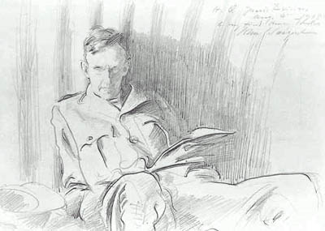

## Le tonking ou tamponnage
### Le tonking ou tamponnage, usage en arts plastiques
 **Le tonking ou tamponnage**  

Ces proc�d�s consistent � tamponner une surface peinte ou enduite, avec du papier absorbant (journal, par exemple) de sorte �  "all�ger la p�te", si l'on peut dire. Dans le cas du tonking, cela s'applique sp�cifiquement � une p�te de peinture � l'huile trop satur�e, faisant "gadoue". L'effet de capillarit� permet d'absorber l'exc�dent d'huile et �vite ainsi le recours � un retrait radical.



L'affirmation selon laquelle le tonking consisterait � "frotter doucement" la p�te avec le papier pourrait provenir d'une erreur de traduction. Il n'est pas question de frotter : on sait tr�s bien les r�sultats que ce mouvement donnerait dans une lourde "gadoue" ! Il s'agit d'absorber, de tamponner tout au plus et c'est bien dans ce sens que le mot tonking est utilis� dans diff�rentes disciplines et pas seulement en peinture � l'huile.

L'appellation "_tonking_" provient du nom d'un peintre britannique, Henry Tonks (1832-1937 - ici, un portrait r�alis� par John Singer Sargent, domaine public) qui fut Principal de la Slade School of Art.

Chirurgien pendant la guerre de 1914-1918 o� fut utilis� le terrible "gaz moutarde", a-t-il �t� inspir� par des pratiques op�ratoires ?

Lire _[L'imprim� et le tamponn�](imprime.html)_. 


 [Communication](http://www.artrealite.com/annonceurs.htm) 

[](index-2.html#20131014)


```
title: Le tonking ou tamponnage
date: Fri Dec 22 2023 11:28:41 GMT+0100 (Central European Standard Time)
author: postite
```
