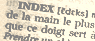
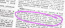
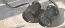

Navig. page/section


\_\_\_\_\_

**Sous cette page**

\_\_\_\_\_

**Pages soeurs**

[Lettre A](a.html)  
[Lettre B](b.html)  
[Lettre C](c.html)  
[Lettre D](d.html)  
[Lettre E](e.html)  
[Lettre F](f.html)  
[Lettre G](g.html)  
[Lettre H](h.html)  
[Lettres IJK](ijk.html)  
[Lettre L](l.html)  
[Lettre M](m.html)  
[Lettres NO](no.html)  
[Lettre P](p.html)  
[Lettres QR](qr.html)  
[Lettre S](s.html)  
[Lettre T](t.html)  
Lettres UV  
[Lettres WXYZ](wxyz.html)  
[Annexe 1 - table des éléments](annexe1.html)

\_\_\_\_\_

Copyright © www.dotapea.com

Tous droits réservés.  
[Précisions cliquer ici](droitscopie.html)

**Lettres U et V**

Accès direct aux autres lettres :

**[Accès direct lettre V](uv.html#v)**

**Index lettre U**

**Commentaires**

Destinations  
(cf. [légende](uv.html#legendeicones))


**[Uranium](uranium.html)**

**[Ures, ites et ates](uresiresates.html)**

**[Uréthane](urethane.html)**

**[Urushi](laquejaponaise.html)**


**Index lettre V**

[Accès index alphabétique](glossaire.html)


**[Valence](valence.html)**

**[Valeur](valeur.html)**

**[Vaseline](vaseline.html)**

**[VECD](vecd.html)**

**Véhicule**

[Voir _Le liant._](liant.html)
**[Vélature](velature.html)**

**[Vélin](velin.html)**

**[VEMP](vemp.html)**

**[Vermeil](vermeil.html)**

**[Vernis](vernis.html)**

**Verre**

A. Verre minéral. C'est le verre commun. [Voir _Le verre._](verre.html)

B. Verre organique. Matière plastique transparente ([Plexiglas ®](plastiques.html#plexy), [Altuglas ®](plastiques.html#altuglas), etc.).


**Vert-de-gris, verdet**

[Passage _in Le vert-de-gris (Les verts)._](verts.html#vertdegris)
**[Vin](vin.html)**

**[Vinaigre](vinaigre.html)**

**[Vinyle](vinylegloss.html)**

**[Virole](virole.html)**

**Viscoélastique**

[Passage in La rhéologie.](rheologie.html#viscoelastique)
**[Viscosité](viscosite.html)**

**Vitamine**

[Passage _in L'amine._](amine.html#vitamine)
**Vitrifier, vitrification**

[Passage _in Courrier des Lecteurs_.](courrierdeslecteurs2011b100.html#20110628lbvitrifier)
**[Vitrocéramique](vitroceramique.html)**

**[Volatil](volatil.html)**

**[Vulcanisation](vulcanisation.html)**

\_\_\_\_\_

**Légende des icônes/liens (destinations)**

_Pour éviter toute surprise lors de la navigation, nous avons créé cette signalétique :_

article du glossaire

article hors glossaire

_passage_ situé dans un article du glossaire

_passage_ situé dans un article hors du glossaire

  liens en "portail", ouvrant sur différentes adresses

 

 [Communication](http://www.artrealite.com/annonceurs.htm) 

```
title: Lettres U et V
date: Fri Dec 22 2023 12:23:54 GMT+0100 (Central European Standard Time)
author: postite
```
