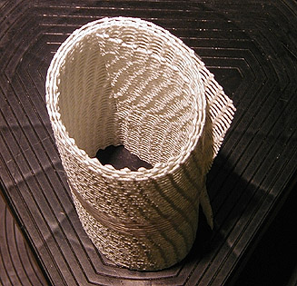

## Le varaforme
### Le varaforme, usage en arts plastiques
 **Le Varaform ®**  Nature et usages du produit

Il s'agit d'une résine thermoformable dont nous n'avons pu, pour l'instant, nous procurer la composition. Elle permet de prendre une [empreinte](moulage.html#empreinte) dans deux buts possible :

> \* la réalisation directe d'objets "en Varaform ®" par application sur un modèle,
> 
> \* la réalisation d'une [copie](moulage.html#copie) par coulage d'une substance à l'intérieur d'un moule en Varaform ®.

Caractéristiques



Elles sont :

> \* la thermoformabilité à basse température. A 70°C, la résine se ramollit et prend la forme du modèle.
> 
> \* elle peut être réchauffée à nouveau et peut resservir en principe indéfiniment (en réalité, tant qu'elle est propre et tant qu'elle n'a pas adhéré à elle-même). Cette aptitude permet la reprise des erreurs de moulage.
> 
> \* l'aptitude à coller à elle-même à chaud, ce qui permet
> 
> > \* d'échapper à certains pièges du démoulage,
> > 
> > \* d'obtenir une certaine épaisseur par accumulation de couches.
> 
> \* une bonne résistance matérielle qui peut être augmentée par la pose de renforts pris en sandwich entre deux feuilles posées successivement ([fil de fer galvanisé](galvaniser.html#galvamodelage), grillage galvanisé, bois, tiges métalliques, tissus, carton, etc.),
> 
> \* la possibilité de servir de support. Elle peut être couverte par du plâtre, de nombreuses peintures et enduits et d'autres substances.
> 
> \* un poids très léger,
> 
> \* une certaine facilité d'emploi, comparativement au plâtre par exemple,
> 
> \* une utilisation très éclectique, dans le monde entier. Cette substance est employée pour créer des oeuvres artistiques par "formation" (oeuvres relativement éphémères) ou par moulage (oeuvres durables), des vêtements, des décors de théâtre, des masques, etc... sans parler des applications médicales et vétérinaires.
> 
> \* un conditionnement pratique, en rouleaux de largeurs variées,
> 
> \* nous manquons de données concernant sa permanence à long terme, mais comme le fabricant l'annonce comme biodégradable...  
> Il faut d'ailleurs insister sur le fait que la thermoformabilité implique une thermosensibilité, donc des conditions de conservation spécifiques. Éviter la proximité de sources de chaleur comme les spots par exemple.

Utilisation du Varaform ®

Ce "mode d'emploi" est forcément généraliste et ne peut concerner la mise en oeuvre proprement dite à cause de la grande variété d'applications possibles.

D'abord, il faut considérer le Varaform ® comme un procédé incluant trois produits ayant des rôles différents :

> \* Les deux premiers ont un usage "structurel". C'est d'ailleurs souvent entre deux couches de ce type que l'on place une "armature"
> 
> > \* le Varaform ® épais-rigide. Dans le cas du moulage destiné au coulage, il est plutôt posé à l'extérieur, en dernier lieu. Dans le cas de la création directe d'objets, il peut être plaqué dans une couche intermédiaire ou en couche interne, selon le cas
> > 
> > \* la variété fine, utilisée en première ou seconde couche
> 
> \* Le troisième produit est "superficiel"
> 
> > \* le Varaform ® très fin, dit aussi "membrane". Ce n'est pas une simple variante des deux autres produits, mais un mélange de gaze de coton naturel et de résine thermoformable. Il est assez précis et permet d'obtenir des résultats lisses.

Évidemment, la souplesse du moule dépend du ou des produit choisis et du nombre de couches. On va du "relativement souple" au "relativement dur", voire au très dur si l'on insère des renforts.

L'utilisation de ces trois produits est similaire :  

> 1. découper la surface désirée à l'aide de simples ciseaux
> 
> 2. tremper dans l'eau à 70°C environ. Le ramollissement s'opère en quelques secondes
> 
> 3. retirer la feuille en vous aidant de morceaux de bois ou de pinces de cuisine en veillant à ce qu'aucune partie ne colle à une autre partie de la feuille
> 
> 4. poser sur le modèle,
> 
> 5. laisser refroidir quelques minutes.

En cas d'erreur ou pour faire fusionner deux pièces de Varaform ®, on peut réchauffer la substance de deux manières :

> \* la manière sèche, conseillée pour les retouches de précision. Un flux d'air chaud (sèche-cheveux) peut suffire, mais pas toujours. Il faut alors utiliser un spot chaud ou un fer à repasser (réglé au minimum) à condition d'éviter tout contact et de bien surveiller la température.
> 
> \* la manière humide. Il s'agit tout simplement de verser de l'eau chauffée à 70°C à l'emplacement de la retouche ou sur l'ensemble du moule si nécessaire.

Points problématiques

La nécessité de chauffer le Varaform ® à 70°C est dans certains cas un inconvénient.

Le moulage d'objets en cire, par exemple, est impossible (sauf peut-être avec [la cire de carnauba](cires.html#laciredecarnauba) dont la température de fusion est un petit peu plus élevée).

Dans le cas ou le Varaform ® est employé à des fins de coulage, seule la paraffine peut théoriquement être employée sans risque de déformation majeure du moule. Il est cependant important de tester d'abord la température de fusion de la cire utilisée car si, en principe, elle avoisine 40-50°C, en réalité, elle peut être adjointe d'ingrédients augmentant cette température, notamment dans le cas des cires de bougies.

Le coulage du plâtre entraîne un échauffement naturel lors du séchage. Il est donc déconseillé d'ajouter de la chaleur à la chaleur et de pratiquer cette opération par fortes températures ambiantes.

Augmenter ou diminuer l'adhérence du Varaform ®

Pour augmenter l'adhérence à un support, il suffit d'enduire celui-ci d'eau chaude. Pour un meilleur résultat, un préchauffage peut être effectué, notamment à l'aide un sèche-cheveux.

Pour diminuer l'adhérence et faciliter le démoulage, enduire le support d'eau froide.


 [Communication](http://www.artrealite.com/annonceurs.htm) 

[](index-2.html#20131014)


```
title: Le varaforme
date: Fri Dec 22 2023 11:28:45 GMT+0100 (Central European Standard Time)
author: postite
```
