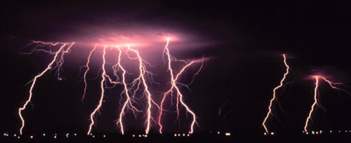

## Le verre
### Le verre, usage en arts plastiques et autres
 **Le verre  
sous différentes formes**

_L'aérogel_, forme très particulière de verre,  
est traité dans les Dialogues de Dotapea.  
[Cliquer ici.](chap05aerogel.html)

_Le verre liquide_ ("Liquid glass" nanotechnologique)  
est traité [ici.](hitechliquidglass.html)

Dans un premier temps, nous n'aborderons pas les très vastes sujet du vitrail et de la verrerie où d'ailleurs le verre joue plus le rôle de substrat que de support. Nous évoquerons plutôt le "matériau verre", description utile quel que soit le procédé.

Le verre, pour être un minéral (à distinguer des "[verres organiques](uv.html#verre)") d'aspect extrêmement transparent, n'est pas pour autant un [cristal](cristal.html). Le cristal siliceux est pourtant une sorte de (faux) verre "idéal" naturel (voir [quartz](quartz.html)).

Le verre est typiquement un composé de [silice](silice.html) et de métaux [alcalins](alcali.html) ([silicates](silicate.html) alcalins) ainsi que d'autres éléments de natures diverses (voir [soude](soude.html), [frittage](frittage.html)).

Ce sont la cuisson de ces substances jusqu'à la [fusion](fusion.html), puis leur refroidissement rapide, qui permettent d'obtenir l'état vitreux.

**En aparté**

Des peintures spéciales - dont certaines cuisent au four alimentaire, à 150 ou 160°C - sont censées adhérer relativement bien au verre. D'autres peintures sont quasiment "faites pour être enlevées". Elles sont destinées à la décoration de vitrines. Voir [Flashe ® in _Le vinyle_](vinyle.html#flashe)_._

Évoquons aussi brièvement la technique du _matte painting_. Cette "peinture mate" (opaque ?) a surtout été utilisée pour créer des effets spéciaux au cinéma avant l'avènement des procédés numériques. Le choix du verre comme support était avant tout lié au besoin de précision, mais aussi à différentes possibilités matérielles. Les "_matte artists_" devaient partir d'une ou plusieurs prises de vue réelles et les transformer, dans une démarche hyperréaliste, en un décor imaginaire dont les caractéristiques étaient indiquées par le réalisateur. Jeu de caches et de couches, travail de [trompe-l'oeil](trompeloeil.html) fort difficile voire très laborieux et peu reconnu, le _matte painting_ a quand même contribué à la réalisation de chefs d'oeuvres du cinéma tels que _Blade runner_ pour ne citer que cet exemple.

En principe, un cristal qui a fondu retrouve sa structure cristalline lorsqu'il refroidit. Or, dans différents cas, dont celui du verre, l'état cristallin n'est pas retrouvé, surtout si le refroidissement est rapide. Le verre froid conserve quelque chose de la désorganisation acquise à l'état liquide. L'état vitreux moyen est de dominante [amorphe](amorphe.html).

Signalons un point de vue physico-chimique particulier :  
le verre vu comme _liquide visqueux_. [Cliquer ici](chap01liants.html#verreliquide)

Il arrive que ce processus s'effectue naturellement sous l'action extrêmement violente de la foudre. Lorsque celle-ci s'abat sur un terrain peu conducteur comme [le sable](sable.html), précisément, elle rentre profondément dans le sol au lieu de s'étaler horizontalement comme elle le fait habituellement. Il en résulte, à froid, un étrange tube de verre nommé _fulgurite_.



(photo  : National Oceanic and Atmospheric Administration/Department of Commerce)

Mais mis à part ce phénomène "fulgurant", dans l'ensemble, la nature est plutôt avare en matière de verre car le refroidissement des roches est généralement lent et occasionne donc le plus souvent une restructuration cristalline.

Il existe deux autres exceptions :

> \* _l'obsidienne_, véritable verre naturel ([photo ci-dessous](verre.html#obsidienne) - remerciements à [Catherine Lisack](quinoussommes.html#catherinelisack)), résultat du contact direct d'une lave très siliceuse avec l'eau. Lire le texte sur _[l'emploi de l'obsidienne en sculpture](autrespierresign.html#obsidienne)_. La fulgurite et l'obsidienne ont bénéficié de conditions naturelles de refroidissement rapide.
> 
> Pour cette raison, les "coulées d'obsidiennes" ne sont pas rares dans les environnements volcaniques humides ou glaciaires. En Islande notamment elles mesurent plusieurs dizaines de mètres.

[](verre.html#obsidiennetxt)

> \* _la palagonite_. Elle est très banale mais... sur les fonds océaniques seulement ! La lave soumise à l'action de l'eau subit en surface un refroidissement violent. Un verre se forme, couvrant le coussin de basalte (_[lire passage in Les basalte](basalte.html#coussinsbasalte)_). Puis, au fil du temps, ce verre finit par subir l'action hydratante de l'eau et devient jaunâtre.

Différents éléments oxydés peuvent former des sortes de verres (on peut évoquer [l'alumine](alumine.html)), mais le plus courant, le plus important, est la [silice](silice.html). Le verre de silice pure est le plus résistant à tous points de vue, mais sa haute température de fusion (1710°C sans fondant sinon autour de 1200°C très approximativement) et les difficultés de mise en forme à l'état liquide expliquent qu'il soit peu courant. La [chaux](chaux.html) carbonée (pierre à chaux) et la [soude](soude.html) sont des "[fondants](fondant.html)" communs permettant d'abaisser cette température. D'autres substances apportent des propriétés plus spécifiques, comme le [spath fluor](spath.html) par exemple.

Le refroidissement est contrôlé à l'aide d'un four à basse température.

L'apport de silice est fourni par un sable blanc (de type Fontainebleau ou Nemours, par exemple) extrêmement proche de la silice pure. Un potier professionnel nous précise cependant que malgré cette pureté, deux sables ne peuvent être identiques et ne peuvent se comporter de la même façon _même s'ils ont été extraits du même gisement_. Les compositions varient subtilement même sur des distances très courtes.

Comme le sable, le verre peut être utilisé comme [abrasif](abrasifs.html), une fois mis en poudre.

Les colorants du verre sont ceux que l'on utilise pour les autres arts du feu  : les "[oxydes](oxydes.html)".

Le verre est fondu, mais il peut également être taillé. Il existe des meules spéciales qui permettent de réaliser ce travail par abrasion.

Des catégories un peu particulières de verres sont les [émaux](email.html) de type [couvertes](couverte.html) et les [glaçures](glacure.html). Ce qui les distingue avant tout, c'est qu'elles sont préparées de sorte à ce qu'elles adhèrent le plus possible à la terre - et parfois au métal. Pour cela, on fait souvent une pâte de verre plus épaisse et "[plastique](plastique.html)" que celle des verriers - notamment afin d'éviter les coulées - en ajoutant de [l'alumine](alumine.html).

Autre différence : les glaçures et les couvertes ne sont, avant cuisson, que des matériaux bruts pulvérulents "posés" sur la terre, dilués dans l'eau, éventuellement appliqués au pinceau ou bien par trempage de la pièce entière, entre autres procédés. A cru, leur couleur est vraiment blanchâtre à cause de la silice et des autres composants. C'est en cuisant qu'a lieu la transformation en verre et que les colorations se révèlent pleinement. L'artisan ou l'artiste doit disposer de solides facultés de représentation mentale pour anticiper sur ce changement qui est radical.

A l'opposé des terres, le verre des verriers est mis en fusion puis façonné et on ne lui applique pas à proprement parler des glaçures.

Dans tous les cas, les éléments ajoutés à la base siliceuse essentielle - contenue dans l'argile, le feldspath et différentes autres substances utilisées comme bases - servent à altérer les propriétés de celle-ci. Les adjuvants modifient la matité, l'opacité, la charge chimique et la couleur des verres et émaux. Ils sont innombrables et parfois surprenant (lire par exemple [l'article _uranium_ du glossaire](uranium.html)).


 [Communication](http://www.artrealite.com/annonceurs.htm) 

[](index-2.html#20131014)


```
title: Le verre
date: Fri Dec 22 2023 11:28:47 GMT+0100 (Central European Standard Time)
author: postite
```
