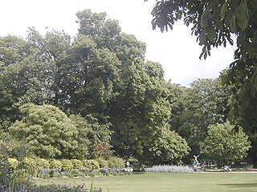
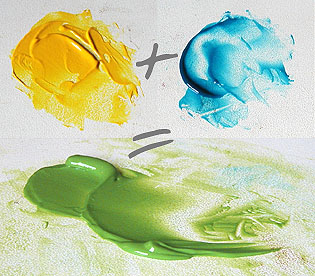
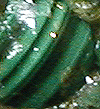
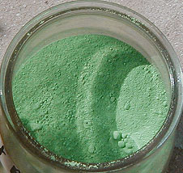

## Les verts
### Les verts, famille de pigments
 **Les verts**  

\[Lectures conseillées :  
[Le vert dans la langue française, Pourpre.com](http://pourpre.com/langue/expressions.php#vert)  
[La couleur verte, Pourpre.com](http://pourpre.com/chroma/dico.php?typ=fiche&ent=vert)\]



_En guise d'introduction, pour situer au mieux le sujet, soulignons le fait que le vert est la couleur dont nous percevons le mieux les variantes, les nuances (lire [Les familles de couleurs](famillesdecouleurs.html))._

_A l'opposé de ce "trésor sensitif du vert" qui est le nôtre, les pigments verts à notre disposition sont longtemps restés à peu près aussi peu courants que [les bleus](bleus.html) - du moins dans la plupart des régions du monde._

_La liste des pigments de qualité correcte ([permanence](pigments.html#permanence), [stabilité](pigments.html#compatibilitesetincompatibilites)) était en effet très courte : la [malachite](verts.html#vertmalachite), hors de prix, et la [terre verte](vertscomplexes.html#laterreverte), voilà tout !_

_Le vert a donc particulièrement poussé les peintres, les teinturiers (qui ne disposent d'aucune teinture verte de qualité - voir [teintures vertes inefficaces](verts.html#teinturesvertesinefficaces)) et tous les professionnels de la couleur à pratiquer les mélanges ([voir ci-dessous](verts.html#synthesesdesverts)), d'autant plus que contrairement à la synthèse du bleu, celle du vert est facile à réaliser. Mais ils se sont heurtés en Occident pendant mille ans à de puissants interdits religieux ne concernant pas particulièrement le vert, mais tous les mélanges (voir [Mélanges de couleur](techmelangecouleurs.html)_).

Sommaire

[1 - Synthèse des verts](verts.html#synthesesdesverts)

[2 - Pigments verts](verts.html#pigmentsverts)

[Vert émeraude et vert viridien](verts.html#vertemeraudeetvertviridien)

[Vert Véronèse ou cendre verte](verts.html#vertveroneseoucendreverte)

[Vert de vessie](verts.html#vertdevessie)

[Vert de Hooker](verts.html#vertdehooker)

[Vert de cadmium](verts.html#vertdecadmium)

[Stil-de-grain](verts.html#stildegrain)

[Verts "phtalo"](verts.html#vertsphtalo)

[Vert japonais](verts.html#vertjaponais)

[Vert de chrome](verts.html#vertdechrome)

[Vert prussiques ou anglais](verts.html#vertsprussiquesouanglais)

[Vert-de-gris](verts.html#vertdegris)

[Le vert de malachite et quelques autres anciens verts de cuivre](verts.html#vertmalachite)

[Toxicité](verts.html#toxicite)

[Vert d'outremer](verts.html#vertdoutremer)

[Vert de Brunswick ou vert de montagne](verts.html#vertdebrunswickouvertdemontagne)

[Teintures vertes inefficaces](verts.html#teinturesvertesinefficaces)

[Autres verts](verts.html#autresverts)

[3 - Les verts les plus subtils (page séparée)](vertscomplexes.html)

_Finalement, après quelques millénaires de recherches, l'être humain a réussi à synthétiser un nombre assez appréciable de pigments verts de bonne qualité._

Lecture conseillée : [Le vert sur Pourpre.com](http://pourpre.com/chroma/dico.php?typ=fiche&&ent=vert)

1 - Synthèses des verts



_Le vert est le domaine d'application par excellence de l'art de la synthèse, particulièrement facile à réaliser. En teinture et en peinture, la Haute Antiquité (mais pas la préhistoire, curieusement) regorge déjà d'exemples de mélanges donnant cette couleur._

Ceux-ci peuvent s'opérer, en [synthèse soustractive](synthesesoustractive.html) (synthèse habituelle pour les peintres), de deux manières :

\*  bleu + jaune \[+ élément additionnel\]

\*  noir et jaune  \[+ élément additionnel\].

La seconde, toujours un peu magique, peut facilement être réalisée en peinture à l'huile, à l'acrylique, au vinyle ou à la gouache et d'autres [détrempes](detrempe.html) dans certains contextes, mais pas par transparence (aquarelle, glacis). Elle est destinée aux peintures plutôt couvrantes, plutôt opaques, sans quoi elle grisaille.

Le risque d'obtenir un gris, quels que soient les pigments utilisés, dépend aussi d'un autre facteur, la transparence. Celle-ci, lorsqu'elle est poussée à un point extrême, peut faire partiellement basculer la synthèse du côté additif (voir [_effets de bord_ in _synthèse additive_](syntheseadditive.html#effetsdebord)) parce que la source de lumière provient en partie de l'arrière-plan. Ce cas de figure n'apparaît que dans des mélanges particulièrement clairs, très fortement dilués.

Les [bleus chauds](bleuschauds.html) ([manganèse](bleuschauds.html#lebleudemanganese) et [phtalocyanine de cuivre](bleuschauds.html#lesbleusphtalo) en premier lieu) donnent, en combinaison avec un [jaune de cadmium](cadmiumsjaunes.html) clair ou moyen ou différents [jaunes azoïques](jaunes.html#lesjaunesazoiques), des verts d'une grande fraîcheur et d'une luminosité importante.

Les bleus moyens comme le [cobalt](bleusfroids.html#lebleudecobalt) donnent des verts "standard".

Les [bleus froids](bleusfroids.html) comme [l'outremer](outremer.html) foncé donnent des verts riches, sophistiqués, impurs, semblables à la [terre verte](vertscomplexes.html#laterreverte) par exemple (outremer foncé + ocre jaune). Jadis, [la guède](bleusfroids.html#lindigomedieval) occupait le même rôle que l'outremer.

Une pointe de rouge peut tout changer, comme le blanc. Les mélanges ternaires (bleu+jaune+X) donnent une gamme infiniment subtile, presque semblable à celle que nous offre le spectacle de la nature.

Tous les verts synthétisés par les peintres sont couramment nommés "verts palette".

2 - Pigments verts

Vert émeraude et vert viridien

"Viridien" --> Lecture conseillée : [Viride sur Pourpre.com](http://pourpre.com/chroma/dico.php?typ=fiche&&ent=viride)

Fabriqué artisanalement puis industriellement dès 1859 (inventeur : Pannetier, industriel : Guignet), le vert émeraude, pigment transparent et un peu froid, était le produit de l'action de l'acide borique sur le bichromate de [potasse](potasse.html). Dans tous les cas, il était toxique (cancérigène, tératogène et mutagène, paraît-il). Il était utilisable comme "[oxyde](oxydes.html)" dans les arts du feu.

La formulation actuellement en usage est un [sesqui](sesqui.html)oxyde de [chrome](annexe1.html#cr) hydraté (voir _[vert oxyde de chrome](vertscomplexes.html#loxydedechrome)_). Elle n'est pas exactement une imitation, car elle a une vraie originalité chimique. C'est plutôt une autre formulation non dépourvue d'intérêt qui de plus n'est que très modérément toxique (éviter les contacts cutanés répétés ou prolongés). La pierre précieuse et les deux couleurs contiennent toutes du chrome.

La version actuelle comme l'original se prêtent, de par leur consistance et leur couleur, au [glacis](glacis.html) principalement, en particulier sur fond clair.

La couleur émeraude gagne à rester claire et transparente sur le tableau, comme la véritable pierre - une splendeur, une surprise de la nature -, nommée _smaragdos_ en grec (d'origine orientale, selon l'Académie) qui peut être claire et lumineuse, parfois aussi un peu moins froide que le ou les pigments de ce nom car elle peut contenir des traces de fer qui la rougissent.

Le terme "viridien" est un anglicisme qui n'est pas parfaitement synonyme de "vert émeraude". Des compositions variées peuvent être découvertes sous cet intitulé.

Lecture conseillée : [Le vert émeraude sur Pourpre.com](http://pourpre.com/chroma/dico.php?typ=fiche&&ent=emeraude)

Vert Véronèse ou cendre verte

Composé d'arséniate de cuivre (acide [arsénieux](annexe1.html#ar) + acide [acétique](acetate.html) passés sur des sels de [cuivre](annexe1.html#cu)), il comptait parmi les pires poisons et virait au noir en présence de [soufre](soufre.html) (et même de plomb selon certains auteurs).

C'est aujourd'hui typiquement un composé [phtalocyanique](phtalocyanines.html) + un oxyde de [zinc](annexe1.html#zn) (blanc). Les variétés sans zinc ni titane sont plus transparentes et beaucoup plus intéressantes car on peut les utiliser comme l'original : en glacis.

Une visite au Louvre permet de comprendre l'intérêt que Paolo Veronese portait aux glacis réalisés avec cette somptueuse couleur employée pure.

Lire aussi l'article sur la [cendre bleue](bleuschauds.html#lacendrebleue).

Lecture conseillée : [Le vert Véronèse sur Pourpre.com](http://pourpre.com/chroma/dico.php?typ=fiche&&ent=veronese)

Vert de vessie

Vert nitroso-naphtol ou azo-nitroso-naphtol aujourd'hui, c'était hier un véritable poison préparé avec du [carbonate de plomb](ceruse.html) et de [l'alun](alun.html). La base chromatique était apportée par une plante, le [nerprun](nerprun.html).

Aussi longtemps qu'aucune imitation ne fut créée, cette couleur ne s'employait qu'en peinture à l'eau. Aujourd'hui, des fabricants proposent un vert de vessie (imitation) pour la peinture à l'huile.

Il faut cependant remarquer que l'imitation elle-même semble présenter quelques inconvénients. Quelques producteurs l'ont même évacuée de leurs gammes.

Sa permanence laisse apparemment à désirer. Sa stabilité en mélange ne serait vraiment assurée que dans la formulation nitroso-naphtol (indications fabricants).

Lecture conseillée : [Le vert de vessie sur Pourpre.com](http://pourpre.com/chroma/dico.php?typ=fiche&&ent=vessie)

Vert de Hooker

Utilisé pour la peinture à l'eau exclusivement, c'est un vert plutôt franc - sans acidité et sans innocence - et assez chaud.

Créé par le peintre William Hooker (voir notamment [octavo.com/collections/projects/hoopom](http://www.octavo.com/collections/projects/hoopom/), en anglais), il était un simple mélange de [bleu de Prusse](bleuschauds.html#lebleudeprusse) et de [jaune du Cambodge](jaunes.html#lagommegutteoujauneducambodge).

Aujourd'hui, seule l'imitation semble disponible. Sa composition en acrylique extra-fine est typiquement :

> \* PBk7 (noir de carbone pur)
> 
> \* PG7 (vert [phtalo](phtalocyanines.html))
> 
> \* PY74 ([arylide](aryle.html) jaune 5Gx).

Une assez jolie combinaison ! D'autres, peut-être moins inventives mais très efficaces, font intervenir un bleu anthraquinonique et un jaune nickel-azoïque.

Ce pigment, ou plutôt sa version contemporaine, est réputé très permanent. Il est en fait souvent semi-permanent. Il est assez transparent à cause du pigment jaune [azoïque](azoiques.html), mais plutôt sombre.

Lectures conseillées :  
[Le vert de Hooker sur Pourpre.com](http://pourpre.com/chroma/dico.php?typ=fiche&&ent=hooker)  
[Octavo.com/collections/projects/hoopom](http://www.octavo.com/collections/projects/hoopom/) (anglais)

Vert de cadmium

C'est un vert très franc, lumineux, couvrant et colorant, à base de sulfure de cadmium-zinc (PY35).

Dans certaines gammes du commerce, il est décliné en "vert de cadmium clair" et "vert de cadmium". Nous n'avons pas testé la variété claire.

Lire _[Les cadmiums](cadmiums.html)_.

Stil-de-grain

Du néerlandais _schijtgroen_, littéralement "vert d'excrément".

Fut-il extrait originellement extrait d'une sorte de guano ? Une chose est sûre : face à l'intitulé de "vert caca d'oie" qui est peut-être le plus proche de son origine réelle, nombre d'intervenants commerciaux des pays francophones ont préféré une appellation plus phonétique, mystérieuse, un peu exotique, qui a servi de véritable fourre-tout.

Il s'agirait en effet en Francophonie de colorants issus du [nerprun](nerprun.html), de la [gaude](laquesanciennes.html#laquedegaude), de feuilles de bouleau, du châtaignier rose et d'autres végétaux, voire plus récemment, de produits directement issus de l'industrie pétrochimique. Déjà, il y a quelques siècles, l'imprécision de l'intitulé "stil-de-grain" semblait fournir l'occasion de donner une nouvelle vie à des couleurs connues - et éventuellement tombées en désuétude - depuis l'Antiquité ou le néolithique.

Le stil-de-grain "habituel" en France, celui d'Avignon, à base de _Rhamnus infectorius_, un épineux, correspond en principe à une laque de teinturier, mais il a aussi servi à teinter du bois et d'autres matériaux. Dans le domaine de la peinture, certains fabricants continuent de nos jours à proposer des stil-de-grain jaunes, verts, rouges et bruns qui ne correspondent à rien de précis. Concernant le "stil" avignonnais, il semble que des imitations de cette probable imitation ont existé.

Nerprun ou autre, il s'agit, même dans ces versions anciennes, de teintures végétales "petit [teint](teint.html)". Sauf erreur, bien que jolies, elles ne semblent guère convenir à des travaux de valeur, sauf renouvellement régulier.

Cependant, dans le cas précis de la dorure, il est possible que les réactions chimiques de la teinture de nerprun avec des métaux lourds présentent des particularités intéressantes. Toute personne disposant d'informations à ce sujet [est bienvenue à les faire connaître.](ecrire.html)

Verts "phtalo"

Voir [bleus "phtalo"](bleuschauds.html#lesbleusphtalo) et [phtalocyanines](phtalocyanines.html).

Vert japonais

C'est aujourd'hui un composé [phtalocyanique](phtalocyanines.html). Les peintres Japonais que nous avons interrogés ne savent pas à quoi correspond, parmi les nombreuses couleurs qu'ils emploient, ce que nous appelons peut-être un peu exagérément "vert japonais".

Vert de chrome

Ne pas le confondre avec le [vert oxyde de chrome](vertscomplexes.html#loxydedechrome). Utilisé au XIXème siècle, le vert de chrome était composé d'un mélange de [bleu de Prusse](bleuschauds.html#lebleudeprusse) et de [jaune de chrome](jaunes.html#lesjaunesdechrome). Sans permanence, fugace et instable en mélange, il est aujourd'hui introuvable.

Il n'est rien d'autre que le principal constituant des [verts anglais](verts.html#vertsprussiquesouanglais).

Verts prussiques ou anglais

Chrome ([voir ci-dessus](verts.html#vertdechrome)), plomb, zinc, ferrocyanure sont les composants de ces couleurs assez variées et numérotées (les verts anglais sont assez nombreux). Dérivées du vert de chrome, lui-même dérivé du bleu de Prusse et du jaune de chrome, elles sont instables en mélange et toxiques. D'habiles imitations [azoïques](azoiques.html) ou partiellement azoïques (remplacement du composant chromé, conservation du ferrocyanure ou autres combinaisons) les ont en bonne partie remplacés.

Comment caractériser leurs teintes ? Disons simplement qu'elles sont "assez naturelles" sans être aussi subtiles que les terres vertes ou l'oxyde de chrome.

Lecture conseillée : [Le vert anglais sur Pourpre.com](http://pourpre.com/chroma/dico.php?typ=fiche&&ent=anglaisvert)

Vert-de-gris

Lecture conseillée : [Le vert-de-gris sur Pourpre.com](http://pourpre.com/chroma/dico.php?typ=fiche&&ent=vertdegris)

_Etymologie  
Altération de_ vert de Grèce_, selon le Robert qui s'inspire probablement d'Alcherius.  
Celui-ci aurait nommé cette couleur "_vert grec_" au XIVème siècle._

Sous sa forme naturelle, c'est un hydrocarbon[ate](uresiresates.html) de [cuivre](annexe1.html#cu) (CH2O-Cu), se formant progressivement à la manière d'une rouille, lors du contact du cuivre - ou d'un alliage en contenant - avec de l'air humide, de l'eau ou un acide.

On a évidemment reproduit ce processus naturel à l'aide, dans un premier temps, d'un élément acide (le [marc](marc.html) de raisin a été particulièrement utilisé, ce qui explique que la production fut concentrée dans certaines zones viticoles) et, éventuellement, dans un second temps, un [vinaigre](vinaigre.html) (de trois jours à neuf mois, en fait deux semaines en général) pour obtenir, à partir de feuilles de cuivre ainsi dégradées, le _verdet, vert-de-gris ou vert de Grèce_, une [acétate](acetate.html) [basique](base.html) de formule brute C2H4O2Cu, plus foncée, d'usage tinctorial ou pigmentaire. Ces composés étaient très prisés durant l'Antiquité.

De longue date (au moins le XVème siècle), des verts de ce type ont été transformés en bleus à l'aide de [sels](formationdesels.html) [ammoniacaux](ammoniac.html). Le chrome et le brome permettent d'obtenir un bleuissement (voir [phtalocyanines de cuivre](phtalocyanines.html)).

Toutes nos sources s'accordent sur un point : les verts-de-gris sont fortement instables en présence d'air, d'humidité ou plus généralement en mélange (particulièrement avec la [céruse](ceruse.html)). Ils sont totalement incompatibles avec les huiles à peindre, on le sait depuis longtemps. Mais vraiment bien isolés et employés à bon escient, ils peuvent résister à l'épreuve du temps. Ils ont été utilisés à Pompéi où ils se sont bien conservés, puis, surtout, au Moyen-âge.

Ils permettraient de réaliser très aisément des faux par l'illusion du vieillissement.


Ils sont vraiment toxiques, mais d'une manière heureusement décelable. Ils occasionnent en effet des lésions - notamment en cas de contact cutané - qui peuvent facilement être identifiées en espérant qu'il ne soit pas trop tard. L'ingestion est très gravement pathogène. Il vaut mieux également éviter d'inhaler ces produits.

Le Vert de malachite et quelques autres anciens verts de cuivre

_**Malachite**_

Etymologie : lire [l'article du glossaire](malachite.html).

Il s'agit d'un pigment vert froid d'usage très ancien et d'origine naturelle, principalement composé de [carbonate](annexe1.html#c) de [cuivre](annexe1.html#cu) extrait en Sibérie, dans l'Oural, dans le Turkestan, en Hongrie, en Chine (haute Antiquité), en Inde, au Tibet, dans le Sinaï et en Égypte ancienne (dès le IIIème millénaire BC) où elle est utilisée en peinture, en joaillerie et en cosmétique. En fait, on la trouve dans des gisements de cuivre aux quatre coins du monde, souvent dans les lieux où l'on extrait aussi l'azurite. [Cennini](livres.html#cennini) désigne d'ailleurs le vert de malachite sous l'intitulé de _verde azzurro_, le vert d'azur ou pierre d'Arménie (dont la variété bleue est l'azurite).



L' aspect du pigment grossièrement broyé est [diapré](diapre.html). La pierre est très vitreuse, _nettement zébrée_ et dans l'ensemble plutôt bleutée que jaunâtre (voir photo, détail d'un travail de [Catherine Lisack](quinoussommes.html#catherinelisack)).

La finesse du broyage joue un rôle extrêmement important, tout comme pour le [lapis-lazuli](bleusfroids.html#lelapislazuliveritable) et [l'azurite](bleuschauds.html#azurite) : certains peuples ont pratiqué exprès un broyage grossier pour conserver la luminosité et la vivacité chromatique de ces pierres. Le broyage fin a cependant été largement pratiqué par ailleurs de sorte à autoriser une utilisation dans les encres aux époques où les verts vifs permanents étaient très rares (la malachite était somme toute le seul).

Aujourd'hui, broyer fin semble un gâchis. C'est davantage la possibilité d'obtenir un pigment naturellement hétérogène de cette qualité qui paraît exceptionnelle. Pourtant, les rares détaillants qui vendent ce produit ne semblent pas tous avoir pleinement saisi l'importance de ce point, certains proposant une fine et coûteuse poudre d'aspect tristement homogène.

La poudre de malachite employée comme pigment est attestée par toutes les sources comme étant _d'une permanence extraordinaire, mais d'un prix extrêmement élevé._ Par ailleurs, _elle ne serait pas stable en mélange_ et aurait été, pour cette raison, souvent utilisée pure (informations non confirmées).

Sa cherté est peut-être ce qui a suscité l'invention (tardive) du [vert de Brunswick](verts.html#vertdebrunswickouvertdemontagne), une imitation. \[note : cette couleur et l'original ont pu être nommés "_verts de montagne_"\]

Rome, fière de ses [terres vertes](vertscomplexes.html#laterreverte), a boudé la malachite en tant que pigment. Le Moyen-âge occidental n'a pas suivi cette tendance et l'a largement utilisée.

Un carbonate de cuivre vif et _chaud_, aurait circulé abondamment à la fin du Moyen-âge. La malachite est plutôt froide. Alors de quoi s'agissait-il donc ? La source de cette information est en principe plutôt fiable, mais il s'agit peut-être d'une erreur ou d'une imprécision ponctuelle. Elle mentionne en effet un jaunissement possible de la malachite utilisée _[a tempera](tempera.html)_ avec du jaune [d'oeuf](oeuf.html).

**Toxicité**

Dans le cas des carbonates de cuivre, elle serait assez faible, sauf en cas d'exposition massive. Elle ne serait pas mortelle mais pourrait entraîner des anomalies respiratoires et, au pire, de l'anémie.

L'acétate de cuivre serait beaucoup plus dangereuse.

Vert d'outremer

C'est un vert bleuté (PG24) synthétisé par de rares fabricants qui semblent décidément mal comprendre la destination de [l'outremer](outremer.html), un bleu dont la froideur fait tout l'intérêt.

Vert de Brunswick ou vert de montagne

En 1764, les frères Gravenhorst de Brunswick synthétisent un vert de malachite, le _vert de Brunswick_ ou _vert de montagne_. Selon certaines sources, la composition pourtant proche de l'original n'a pas les qualités de ce dernier. Nous ne sommes pas en mesure de valider ni d'invalider cette affirmation.

L'intitulé de _vert de montagne_ a également pu désigner la [malachite](verts.html#vertmalachite) dont le vert de Brunswick est une imitation moins coûteuse.

Teintures vertes inefficaces

La _teinture de feuilles de boulot_ est née, en Europe du Nord, de la pénurie communément répandue pendant longtemps de substances tinctoriales vertes. Elle serait plus brune que verte.

D'autres teintures de très mauvaise qualité sont nées à cause des interdits religieux du Moyen-âge occidental (voir _[Mélanges de couleurs](techmelangecouleurs.html)_). Elles sont souvent d'origine végétale. De nombreuses plantes ont été essayées avec des résultats médiocres. Nous n'en mentionnerons qu'une : le prunier ([merci de nous communiquer toute expérience de teinture avec cette plante](ecrire.html)). La feuille de cette arbre aurait pu donner des teintes valables, mais le procédé n'a rien donné à cette époque. Il en alla de même avec les substances minérales.

Autres verts

Le vert du lys azurin (iris) ou "vert d'iris" serait facile à fabriquer à l'aide de jus de pétales d'iris et de poudre [d'alun](alun.html). Nous n'avons pas d'informations concernant sa permanence. C'est un colorant utilisé en enluminure, de même que le vert extrait de la _prugnamerola_ (petite prune du Latium).

Vert Armor, vert d'Antioche, vert Aubusson, vert de Sèvres, vert de Saxe : nous enquêtons sur ces pigments.



Le vert de [baryte](baryte.html), sorte de curieux mélange de chrome, de baryum, de strontium et d'autres éléments, demeure pour nous un mystère. Nous en avons trouvé un échantillon d'une certaine beauté (voir photo ci-contre), mais il faudra du temps pour en tirer des informations fiables.

_Si vous disposez d'informations concernant ces couleurs, n'hésitez pas à [nous écrire](ecrire.html)._

3 - Les verts les plus subtils

_Ils sont traités sur une page séparée. [Cliquer ici.](vertscomplexes.html)_


 [Communication](http://www.artrealite.com/annonceurs.htm) 

[](index-2.html#20131014)


```
title: Les verts
date: Fri Dec 22 2023 11:28:48 GMT+0100 (Central European Standard Time)
author: postite
```
