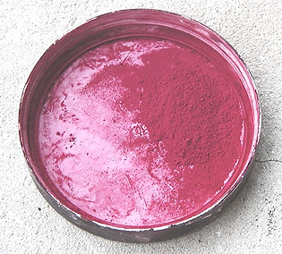
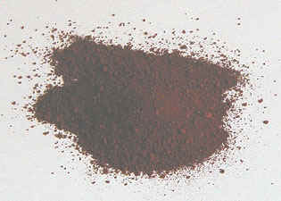

## Les violets et les mauves
### Les violets et les mauves, famille de pigments, usage en arts plastiques et autres
 **Violets et mauves**  Le mauve a une histoire moins extrême que le violet. Au sujet de son origine étymologique, lire [l'article du glossaire sur la malachite](malachite.html). 

_Le violet de cobalt_

Composition : [phosphate](phosphate.html) de [cobalt](cobalts.html), parfois hydraté.

Il est semi-transparent et d'une permanence moyenne. Fait étrange : certains auteurs lui prêtent une totale indestructibilité, contrairement à ce qu'annoncent certains fabricants. Il est coûteux.

_Le violet outremer_

Il s'agit de silico-aluminate de sodium qui semble sulfuré dans certaines formulations et non sulfuré dans d'autres (informations fabricants).

Il est modérément colorant, modérément couvrant mais moyennement lumineux (ce qui est déjà remarquable pour un violet). Surtout, il est stable en mélange (sauf les variétés sulfurées de mauvaise qualité, incompatibles avec le plomb) et permanent.

Il est relativement peu courant, mais différents fabricants le proposent effectivement.

Voir [Famille chimique des outremers](outremers.html) et [Les bleus outremer](outremer.html).

_Le violet minéral ou violet de manganèse_

[Lire l'article _Les manganèses_ in _Familles chimiques de pigments._](manganese.html)  
[Lire l'article _Manganèse_ du glossaire.](manganese2.html)

A base de [phosphate](phosphate.html) de manganèse (on mentionne aussi la présence [d'ammonium](ammonium.html), mais il semble de toute façon que sa structure moléculaire ne soit pas parfaitement connue), il est assez coûteux. Il est bien opaque mais moyennement permanent. Il tend nettement vers le rouge.

Son emploi en peinture à l'huile pourrait poser un problème de [siccativité](sechagesiccativation.html) excessive. Le manganèse associé à l'oxygène faisant partie des siccatifs les plus puissants pour la peinture à l'huile, nous émettons quelques réserves quant à son emploi dans ce procédé  : provoquant des "différentiels" de siccativation, il peut créer des craquelures, des plissements et autres accidents. Il ne peut être employé sans danger pour cette peinture que "pris en sandwich" entre deux couches de glacis isolant (il est conseillé de respecter des temps de siccativation corrects).

Il est également déconseillé pour les peintures à l'eau par différents fabricants, mais il faut signaler l'existence de plastiques et résines industrielles pourvues de ce pigment.

On en mentionne son emploi en France dès le paléolithique (autour de 20 000 BC), mélangé à l'eau ou à la graisse sous la forme d'un minéral réduit en poudre. Il aurait été largement utilisé dès les néandertaliens sous forme de bâtonnets. 

_Le violet de Solférino_

Peu courant, il est déconseillé par Xavier de Langlais qui précise qu'il est composé d'[aniline](anilines.html), ingrédient très fugace. Nous invitons les internautes acheteurs de ce produit à vérifier préalablement la composition annoncée par le fabricant.

Après enquête, nous constatons que certains violets et magentas de Solferino de bonne marque sont en fait des [quinacridones](quinacridones.html), dépourvus de la moindre trace d'aniline et très permanents. D'autres sont des "laques de xanthène", un composé que nous connaissons mal. Lire [l'article du glossaire sur le xanthène](xanthene.html).



_Le magenta et le rose tyrien_

Longtemps, la couleur nommée usuellement "rose tyrien" en France a constitué le principal substitut au magenta, couleur théorique. Il présentait cependant le même inconvénient que tous les pigments jouant ce rôle : une fugacité notoire. Mais le véritable rose tyrien n'a aucun rapport avec la peinture : c'est une authentique [pourpre](pourpre.html), dite aussi "pourpre royale".

[Couleur primaire en synthèse soustractive](synthesesoustractive.html#primaires), le magenta (photo ci-contre) est peu employé hors du contexte scolaire. Longtemps fabriqué avec des ingrédients très peu permanents de type [aniline](anilines.html) (comme le rose tyrien), un version à base de [quinacridone](quinacridones.html), d'une longévité bien supérieure, semble de nature à faire du magenta une véritable référence en peinture. Elle est souvent nommée "acra magenta" ([voir ci-dessous](violetsetmauves.html#levioletetlemagentaacra)).

Quant à l'authentique rose tyrien originel, nous n'avons pas terminé d'enquêter au sujet de sa composition. [Merci de nous communiquer toute information à son sujet.](ecrire.html)

Lecture conseillée - notamment pour l'étymologie du mot magenta - : [Le magenta sur Pourpre.com](http://pourpre.com/chroma/dico.php?typ=fiche&&ent=magenta)

_Le violet d'Egypte_

Parent du [bleu d'Egypte](bleusfroids.html#lacendrebleue) ?

Nous ne connaissons que son imitation - superbe - composée de [dioxazine](dioxazines.html) et de [phtalocianine de cuivre](phtalocyanines.html). Toute information sur l'original est la [bienvenue](ecrire.html).

_Les violets de dioxazine_

Lire [l'article consacré à cette substance synthétique](dioxazines.html).



_Le violet de Mars et l'hématite_

Lire absolument l'article consacré aux [oxydes de fer et à leur calcination](oxydesdefer.html).

Le violet de Mars est un brun de Mars (oxyde de fer brun) calciné. Mais il existe à l'état naturel et c'est alors une variété [d'hématite](oxydesdefer.html#lhematite).

Nous l'avons synthétisé (la photo ci-contre a été éclaircie pour mettre en valeur la couleur de ce pigment assez sombre) avec une cuisinière ordinaire et une simple casserole. Par rapport à l'original, brun chocolat, il est transformé. Il devient nettement plus rouge, plus lumineux, mais pas franchement violet. Comparativement aux oxydes de fer rouge et dérivés (Sienne brûlée, ocre rouge, rouge de Mars), il est plus intense, un peu plus sombre et plus froid. En fait, il ressemble aux [rouges anglais et indiens](terresrouges.html#rougevenitienrougeindienrougeanglais).

Nous avons cru pendant un temps que la cuisson que nous avions infligée au pigment était insuffisante pour produire un véritable violet. Nous avons cependant enquêté et découvert que les tubes de violet de Mars du commerce ont tous exactement la même couleur que celle que nous avions obtenue. C'est donc bien cette teinte rouge que certains nomment _violet_ !

En conclusion, nous conseillons à nos chers visiteurs de se méfier des appellations, même si, en l'occurrence, c'est l'histoire qui continue à influencer l'intitulé de cette couleur (voir [introduction](violetsetmauves.html#introduction)).

**Concernant l'hématite**, nous ne la traitons pas dans la page "Violets et mauves", contrairement à différents auteurs, afin de ne pas entretenir une confusion d'origine historique (cf. [introduction](violetsetmauves.html#introduction)). Les Grecs l'assimilaient à juste titre au sang, pourquoi, donc, l'associer au violet ?

[Lire l'article du glossaire.](hematite.html)

_Le grenat_

Lire [texte _in_ Les rouges et les roses](rouges.html#legrenat) et surtout [l'article du glossaire](grenat.html).

_Le violet et le magenta "acra"_

Il s'agit de différentes variantes [quinacridoniques](quinacridones.html). Nous enquêtons actuellement sur l'origine du terme "acra". Toute information est [bienvenue](ecrire.html).

_Le caput mortuum_

Cette sinistre appellation désigne un violet grisâtre cadavérique. On peut féliciter les peintres qui s'affranchissent des encombrantes visions que peut suggérer l'intitulé de "_caput mortuum_", tête de mort, pour n'en retenir que l'aspect chromatique, au demeurant très intéressant. Dans l'offre commerciale, la composition de cette couleur est variable.

Malgré nos recherches, nous manquons cruellement d'informations au sujet de la genèse de cette couleur. [Merci de nous apporter toute information à ce sujet](ecrire.html).

_Le bois de campêche_

L'arbre, implanté en Amérique tropicale, particulièrement dans le golfe du Mexique, fait partie de la famille des césalpinées.

Utilisé par les Amérindiens, il est, dès l'arrivée des Européens, l'objet d'un commerce de première importance. En variant les produits de [mordançage](mordant.html), on obtient des teintes allant du bleu au rouge, soit beaucoup de violets et de mauves, ainsi que des gris et des noirs. Ce sont ces derniers qui survivront durablement à la découverte de la fugacité des autres teintes obtenues.

Le noir de campêche n'a pas totalement disparu, mais il fut largement employé (souvent associé au [noir des feuilles de châtaignier](noirs.html#feuillesdechataigner)) jusqu'à la découverte de produits de synthèse au XXème siècle.

_L'orcanette_

C'est véritablement un colorant intercontinental. Il est extrait des racines de la plante éponyme (Borraginacées - [voir absolument _Le borax_](borax.html)). Il fut utilisé - et l'est encore parfois - sur tout le bassin méditerranéen depuis l'Antiquité (Perse, Grèce, Égypte, Gaule, Europe centrale), mais aussi en terre saami (anciennement Laponie), en Sibérie (variété jaune paraît-il), au Japon, en Inde, et encore en Afrique du Nord jusqu'au Maroc.

L'orcanette a disparu (Moyen-âge) et réapparu plusieurs fois, localement ou plus largement.

Elle se décline en plusieurs variétés et porte de nombreux noms, parmi lesquels le latin _alcanna tinctoria_ qui proviendrait de l'arabe _al-henneh_ à cause de sa ressemblance avec le [henné](rouges.html#lehenne) (ou parce que ce terme était plus générique que l'on ne croit), _murasaki_ en japonais, qui signifie simplement _violet_, ou encore "le buglosse des teinturiers" (le buglosse est une autre plante de la famille des Borraginacées), etc.

Trois continents, 2500 ou 3000 ans d'âge au moins : c'est une star sur laquelle il est impossible de faire l'impasse bien que partout sa magnificence n'ait dissimulé à quiconque sa **grande fugacité**.

Elle a surtout été employée comme teinture. Le [mordant](mordant.html) est souvent [l'alun](alun.html), ce qui n'a rien d'original, mais il semblerait que des adjuvant soient nécessaires et d'autres substances sont utilisées.  Notre correspondant au Japon, le peintre [Shinji YAMADA](quinoussommes.html#shinjiyamada), nous a rapporté comment l'on y opère :

_On plonge alternativement le tissu dans le jus de la racine puis dans de la cendre diluée dans l'eau, probablement avec d'autres éléments. On obtient une gamme de couleurs du violet-rouge au violet-noir en fonction de la durée de chaque plongée et de la température de l'eau._

La cendre utilisée était-elle de la cendre d'orcanette ? Cette information nous manque, mais c'est fort possible car le procédé consistant à faire brûler une plante contenant du salpêtre potassique afin d'extraire de la potasse est bien connu. Elle est même à l'origine du mot potasse ([cf. article du glossaire](potasse.html)). Ainsi, il n'est pas à exclure que l'une des particularités remarquables de cette plante soit de permettre non seulement une coloration, mais aussi une [saponification](saponification.html), ce qui expliquerait notamment son emploi passé en cosmétique (hypothèse non confirmée).

En Europe, on signale dans certains procédés l'utilisation [d'alcool](alcools.html) (à partir de 35%), mais aussi d'huile (liant) et [d'alcalis](alcali.html) (adjuvants). Le jus d'orcanette se dilue en effet mal dans l'eau pure.

L'utilisation en cosmétique de cette plante est mentionnée dès le monde antique puis, plus tard, dans le monde arabo-musulman, mais elle semble ne pas s'être avérée bénigne au fil des temps. C'est peut-être pour cette raison que l'orcanette disparaît : teinture superbe mais trop fugace, cosmétique présentant des effets secondaires, il ne lui reste que peu d'applications dans le monde contemporain.

_Violets occidentaux anciens_

**Le violet de Bayeux**

Nous enquêtons sur l'origine de cette couleur permanente et opaque actuellement composée usuellement (offre commerciale) de [thioindigo](bleusfroids.html#thioindigo) et ayant anciennement contenu un [indigo](bleusfroids.html#lindigo) (mais lequel ?). Toute information est [bienvenue](ecrire.html).

**Le violet de tournesol**

C'est un violet médiéval, fabriqué à l'aide de la plante éponyme. Voir absolument [Le bleu tournesol in Les bleus froids](bleusfroids.html#tournesol).

**La maurelle**

C'est un arbuste (euphorbiacées) dont, au Moyen-âge, on extrayait la sève. Le colorant obtenu serait plutôt brun (voir [introduction](violetsetmauves.html#introduction), [violet de Mars](violetsetmauves.html#levioletdemars)).

Selon une lectrice de Dotapea (que l'on remercie), la revue France pittoresque n° 29 précise ceci :

« _La tinctoriale herbe aux verrues, plante vert grisâtre exclusivement récoltée par les Gallargois (habitants de Gallargues, Hérault) la maurelle fut longtemps et singulièrement transformée au moyen de chaux et d'urine humaine en « drapeaux » chiffons gorgés de son suc exportés en Hollande où ils confèrent a la croûte du fromage une couleur caractéristique._ »

**L'orseille**

Elle est tirée de la rocelle (Roccella tinctoria), lichen poussant sur la roche en bordure de la mer Méditerranée. Utilisée dès la haute antiquité mésopotamienne, elle donne une teinture. Sa préparation exige l'apport d'ammoniaque (d'ou l'emploi d'urine, [voir passage in L'ammoniaque](ammoniac.html#urine)).

L'orseille est utilisée au Moyen-âge comme "[laque](laques.html)" (voir [laques anciennes](laquesanciennes.html))

Sa teinte serait d'un rouge violacé.

Fort utilisée en France lors d'une courte période du XIXème siècle, elle a pu être nommée "pourpre française" (voir [pourpre](pourpre.html)) car on aurait découvert alors un procédé pour en faire une teinture plus fixe qu'auparavant, ce qui faisait d'elle un nouvel enjeu économique à l'époque où l'humanité avait perdu le secret de fabrication du seul rouge-violet [permanent](pigments.html#permanence), [la pourpre](pourpre.html).

L'orseille aurait disparu pour deux raisons (nous empruntons l'information à un excellent livre [d'Anne Varichon](livres.html#annevarichon)) :

\* elle aurait été supplantée par la mauvéine (voir [indican](bleusfroids.html#mauveine), [anilines](anilines.html)), synthétisée au XIXème siècle à partir de goudrons de houille, disparue depuis lors,

\* elle se serait avérée toxique et aurait été abandonnée au XXème siècle pour cette raison.

**Les fruits rouges**

La mûre, fruit de la ronce (non du mûrier en l'occurrence), aurait été utilisée ainsi que d'autres petits fruits comme la groseille. D'usage local, ils donnaient des couleurs très fugaces - sauf, dans certains cas, notamment la mûre précitée.

Celle-ci, selon les lieux et les époques semble tantôt fugace et d'usage mineur (teinture de très [petit teint](teint.html), réalisée de manière assez classique avec [l'alun](alun.html) comme mordant en Occident), tantôt d'une [permanence](pigments.html#permanence) remarquable, notamment employée par les Peuples du Nord qui l'utilisaient non seulement comme teinture mais aussi comme peinture pour les masques, ou encore en Asie centrale dans la fabrication de tapis remarquables. Choix des baies, variétés différentes (il existe des milliers de variétés de ronces) ou secret de fabrication, nous ne saurions nous prononcer sur les raisons de ces écarts très substantiels de permanence. 

Les autres fruits rouges ne sont pas particulièrement réputés sous ce rapport.

Pourtant, leurs intérêts gustatif et olfactif, les réminiscences qu'ils peuvent évoquer, ne sont pas à dédaigner pour les plasticiens (installations, tableaux voire performances).

Tout témoignage à leur sujet [nous intéresse](ecrire.html).

Appellations non contrôlées

_L'alizarine violette_

Personne ne peut concevoir en quoi ce dérivé de [l'alumine](alumine.html) proposé par quelques fabricants de peintures peut présenter le moindre rapport avec l'alizarine (voir [garance](garance.html)). Colorante et lumineuse, moyennement permanente, elle peut présenter de l'intérêt malgré son étrange appellation commerciale.

_Le violet de folium_

Ce pigment mystérieux est évoqué [dans l'article consacré à l'indigo](bleusfroids.html#lindigo).

Autres violets

Le zinzolin semble surtout une teinture. Il est extrait des graines de sésame. Son origine et son étymologie (_djoudjolan_) sont arabes.

Lecture conseillée : [Le zinzolin sur Pourpre.com](http://pourpre.com/chroma/dico.php?typ=fiche&&ent=zinzolin)


 [Communication](http://www.artrealite.com/annonceurs.htm) 

[](index-2.html#20131014)


```
title: Les violets et les mauves
date: Fri Dec 22 2023 11:28:49 GMT+0100 (Central European Standard Time)
author: postite
```
